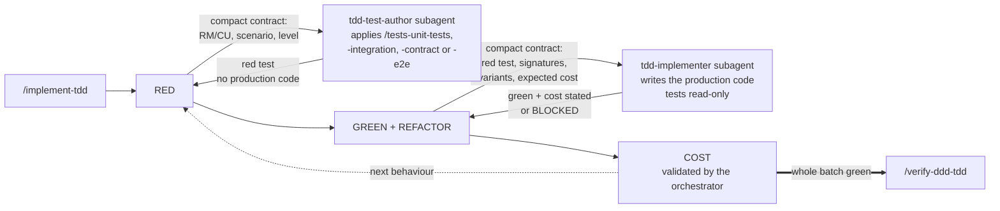

# Claude Code Toolkit

My starting `.claude` folder. What I copy into a new .NET / DDD / clean-architecture repo so that Claude Code works the way I want from the first session: agents, layer rules, hooks, TDD skills, statusline.

No application code here. Nothing to build, nothing to test — only `.md`, `.sh` and JSON.

## How it chains together

Four skills in a chain. Each step produces a file the next one reads — nothing travels through the conversation context, and no step starts without the previous one's artefact.


`/implement-tdd` is not a step but a loop: one full turn per business behaviour, in the order Domain → Application → Infrastructure → WebAPI.



Four points carry all the rest:

- **`/implement-tdd` writes neither its tests nor its code.** RED goes to the `tdd-test-author` subagent, allowed to touch test files and nothing else. GREEN and REFACTOR go to `tdd-implementer`, for which test files are read-only: a test that cannot go green without being modified comes back as `BLOCKED` instead of being weakened. The orchestrator produces nothing — it splits, reads the diffs, validates the cost and settles the design.
- **Subagents produce and declare, the orchestrator judges.** That is also what keeps the main context usable over a long batch: build and test logs stay with whoever caused them.
- **`COST` is a phase, not a review.** No test measures the number of Infrastructure calls: green proves nothing on that axis. An `await` on a repository inside a loop goes back to design.
- **`/verify-ddd-tdd` runs before the next batch**, in a fork and with no write access. It audits the delivered code as it is first, and only then its conformance to the plan — the plan is not the ultimate reference, it gets corrected mid-batch.

## Not a template to install as-is

This kit encodes **my** way of working, not a universal best practice. Among other things it imposes:

- strict TDD, red test before the code, no exception;
- zero comments in production, XML `///` doc included;
- surgical change — no opportunistic refactor of adjacent code that worked;
- a material ban on committing (`git-guard.sh` blocks `add` / `commit` / `push`);
- one `CLAUDE.md` per handler folder, with a business-rules ↔ tests table checked by a hook;
- a quota of 3 `grep` per session to force going through an AST graph.

On another project, with other conventions or another tolerance for ceremony, half of these constraints are noise. Taking the kit wholesale mostly leads to fighting it.

The use I recommend: **cherry-pick**. A hook, a path-scoped rule, the structure of a skill, the traceability mechanism. The bricks are independent — except `skills/`, which refers back to `rules/`.

## What is inside

| Folder | Contents | Install target |
|--------|----------|----------------|
| `agents/` | `tdd-test-author` (writes the RED tests), `tdd-implementer` (writes the production code in GREEN), `ddd-tdd-auditor` (audits a batch, read-only) | `<repo>/.claude/agents/` |
| `rules/` | 5 path-scoped rules: `domain`, `application-cqrs`, `infrastructure-ef`, `webapi-endpoints`, `tests` | `<repo>/.claude/rules/` |
| `hooks/` | 7 hooks: Git guard, grep quota, rules ↔ tests traceability, AST graph resync | `<repo>/.claude/hooks/` |
| `skills/` | 8 skills: the spec → plan → implementation → audit chain, plus 4 test skills | `<repo>/.claude/skills/` |
| `settings.json` | hook wiring + statusline + base permissions | `<repo>/.claude/` (merge if the file exists) |
| `statusline-command.sh` | git branch, model, context %, effort, 5 h rate limit, caveman badge, graph lag | `<repo>/.claude/` |

## Installation

1. **Copy** the folders you want into `<repo>/.claude/`. The skills read `.claude/rules/*.md`: copying `skills/` without `rules/` breaks their references.

2. **Wire it up** — copy `settings.json` to `<repo>/.claude/settings.json`, or merge its `hooks` and `statusLine` keys into the existing file. The commands there are written with `$CLAUDE_PROJECT_DIR`, never an absolute path: that is what makes the setup portable.

   The shipped `settings.json` is a shareable template, not a `settings.local.json`: no one-off session grant, no machine path, no `skillOverrides` bound to skills absent from the kit. Its `allow` list covers the strict minimum (`dotnet`, `rtk`, `gh pr`, `python3`, `graphify query|explain|path`, purging the grep counter, `git check-ignore`). Broad grants — `Bash(rm *)`, `Bash(cd *)` — are deliberately excluded: adding them means letting an agent delete outside its scope.

3. **Substitute `{{PRODUCT}}`** and adapt the points below, otherwise the rules never load and the traceability hook finds nothing.

## Anonymisation

The kit comes from a real repo. The product name has been replaced everywhere by the `{{PRODUCT}}` placeholder:

```
src/{{PRODUCT}}.Domain/          namespace {{PRODUCT}}.Application.Catalog.Products;
tests/{{PRODUCT}}.UnitTests/     dotnet test --project tests/{{PRODUCT}}.UnitTests/…
```

One substitution is enough to make the kit operational:

```bash
grep -rl '{{PRODUCT}}' .claude/ | xargs sed -i '' 's/{{PRODUCT}}/MyProduct/g'
```

The code examples rest on a neutral fictional domain — aggregates `Product` and `ModuleDiagram`, sub-entities `ProductItem` and `DiagramNode`, bounded contexts `Catalog` and `Studio`. Nothing there matches an existing project. Rewriting them with the target domain's vocabulary makes the examples more telling, but is not needed to make things work.

## Adaptation points

The kit assumes a repo shaped as `src/{{PRODUCT}}.<Layer>/` + `tests/{{PRODUCT}}.<Suite>/`. Without that shape, adapt at least:

| File | Line(s) | What to change |
|------|---------|----------------|
| `rules/domain.md` | `paths:` frontmatter | Domain project glob |
| `rules/application-cqrs.md` | `paths:` frontmatter | Application project glob |
| `rules/infrastructure-ef.md` | `paths:` frontmatter | Infrastructure + migrations globs |
| `rules/webapi-endpoints.md` | `paths:` frontmatter | WebAPI + public/SDK contract globs |
| `rules/tests.md` | `paths:` frontmatter | tests glob |
| `hooks/handler-claude-md-check.sh` | `APP`, `UT`, `CT` (l. 23-25) | paths of the Application, UnitTests and ContractTests projects |
| `hooks/graphify-enforce.sh` | `non_source`, source folder list | the repo's source folders |
| `hooks/graphify-freshness.sh` | scanned dirs, extensions | indexed languages and folders |
| `hooks/caveman-skill-ultra.sh` | `case "$skill"` | skills that must force `caveman=ultra` |
| `agents/tdd-test-author.md`, `agents/tdd-implementer.md` | `dotnet test` command | test project path pattern |
| `skills/implement-tdd/references/test-scope.md` | `{{PRODUCT}}`, test environment variable, namespace roots, filter examples | projects, suites actually present, integration test splitting |
| `settings.json` | `permissions.allow` | tools specific to the target repo |
| `skills/*/SKILL.md`, `skills/*/references/*.md` | code examples | namespaces and aggregate names |

The `graphify-*` hooks derive the repo root from `dirname "${BASH_SOURCE[0]}"`: no absolute path to fix, but they assume the `.claude/hooks/` depth. Override with `GRAPHIFY_REPO`.

## Hooks

| Hook | Event | Role | Blocking |
|------|-------|------|----------|
| `git-guard.sh` | `PreToolUse:Bash` | forbids mutating Git commands (`add`, `commit`, `push`), including through `rtk git`, `git -C`, `cd && git`. Reading stays free | yes |
| `graphify-enforce.sh` | `PreToolUse:Bash`/`Agent` | caps at 3 `grep`/`find`/`rg` per session, pushes towards the AST graph. Ignores non-code targets and heredocs | yes past the quota |
| `rtk-normalize.sh` | `PreToolUse:Bash` | normalises `/usr/bin/grep` to `grep` so the RTK rewrite matches | no |
| `caveman-skill-ultra.sh` | `PreToolUse:Skill` | forces `caveman=ultra` when entering certain skills | no |
| `handler-claude-md-check.sh` | `PostToolUse:Edit\|Write` | cross-checks the `## Business rules` table of the handler `CLAUDE.md` files against the tests actually present; reports untested rules and orphan tests | no, warning only |
| `graphify-autosync.sh` | `Stop` | rebuilds the graph if the working tree moved. `mkdir` lock, anti-shrink guard (auto `--force` if the drop is ≤ 2 %) | no |
| `graphify-freshness.sh` | called by autosync + statusline | counts the sources newer than `graph.json`, 20 s TTL cache | no |

## Skills

Main chain: `business-spec` → `plan-implementation` → `implement-tdd` → `verify-ddd-tdd`.

| Skill | When |
|-------|------|
| `business-spec` | short, testable business spec, no technical design |
| `plan-implementation` | validated spec → DDD plan split into batches, tracing RM/CU and decisions |
| `implement-tdd` | implements an all-layer batch under strict TDD; delegates RED to `tdd-test-author`, GREEN and REFACTOR to `tdd-implementer` |
| `verify-ddd-tdd` | audits the batch before moving to the next one; runs in a fork on `ddd-tdd-auditor` |
| `tests-unit-tests` | handlers/services: business rules, query results, command events |
| `tests-integration-tests` | repositories / persistence, Testcontainers |
| `tests-contract-tests` | public HTTP contract, Verify snapshots |
| `tests-e2e-tests` | lifecycle of at least two operations, never an isolated endpoint |

## What the kit imposes on the repo installing it

**Layer separation** — the Domain depends on nothing (no HTTP, no EF, no DTO). Application orchestrates: load, call the Domain, save the events, return. Infrastructure and WebAPI translate IO and carry no business rule. Resource bounds sit at the WebAPI boundary, never in Domain nor in Application.

**The `rules/*.md` files are the single source of the layer conventions.** They load when a matching file is opened. Naming tables live in the rule of the layer that owns the artefact — nowhere else. Two sources that drift make the choice random.

**Strict TDD** — Red-Green-Refactor. The red test precedes the code, the REFACTOR phase cleans up *then deletes* (a defensive branch made impossible by an invariant, an indirection with a single caller, dead code introduced by the batch).

**Surgical change** — every modified line ties back to the behaviour at hand. No improvement of adjacent code that worked, no renaming or reformatting outside scope, no flexibility "for later". An adjacent bug outside scope is reported, not fixed. `verify-ddd-tdd` audits that axis hunk by hunk: a hunk with no owning RM/CU is a gap, even if it improves the code.

**Zero comments in production**, XML `///` doc included — intent is carried by naming. Pre-existing comments explaining a decision, a constraint or an exception are kept; only touch them within the lines you touch.

**Rules ↔ tests traceability** — every handler folder carries a `CLAUDE.md` with a `## Business rules` table whose Tests column cites `TestClass.Method`. `handler-claude-md-check.sh` checks both directions.

**Never commit to Git.** The user decides when to commit. `git-guard.sh` makes the instruction deterministic.

**Done checklist** — never announce completion without: the relevant tests green, no regression, plan files marked ✅ with a date, the handler's `## Business rules` table up to date (Tests column included), the parent feature's index `CLAUDE.md` up to date if a handler is added or its intent changes.

## Dependencies

Only `jq` and `python3` really count. The rest degrades cleanly — and three of these tools are not public, they stay referenced because I use them.

| Tool | Required by | If missing |
|------|-------------|------------|
| `jq` | statusline, `graphify-enforce.sh`, `graphify-autosync.sh` | silent statusline, grep quota not enforced |
| `python3` | `handler-claude-md-check.sh`, `caveman-skill-ultra.sh` | inert hooks, exit 0 |
| `graphify` (`~/.local/bin/graphify`) | autosync, freshness | autosync logs "graphify not found, skip" and exits 0 |
| `rtk` | `rtk-normalize.sh`, prefixed commands in the skills | drop the `rtk ` prefix from the skills, nothing else breaks |
| `caveman` plugin | `caveman-skill-ultra.sh`, statusline badge | flag written with no effect |

Every hook exits 0 when its dependency is missing, except `git-guard.sh` and `graphify-enforce.sh` which block by design. Removing the `graphify-*`, `rtk-normalize.sh` and `caveman-skill-ultra.sh` hooks from `settings.json` leaves a coherent kit.

## Elsewhere

Other repos configuring a coding agent, from other angles: **[RESOURCES.md](RESOURCES.md)**.

## Licence

[MIT](LICENSE). Take what you want, closed-source projects included.
