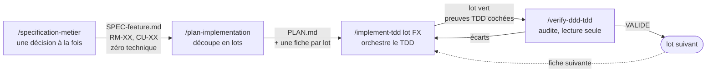
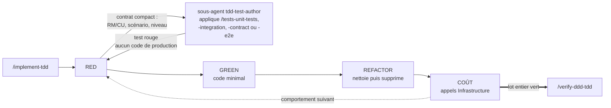

# Claude Code Toolkit

Mon dossier `.claude` de départ. Ce que je copie dans un nouveau repo .NET / DDD / clean architecture pour que Claude Code y travaille comme je veux dès la première session : agents, règles de couche, hooks, skills TDD, statusline.

Pas de code applicatif ici. Rien à builder, rien à tester — que des `.md`, des `.sh` et du JSON.

## Comment ça s'enchaîne

Quatre skills en chaîne. Chaque étape produit un fichier que la suivante lit — rien ne se transmet par le contexte de conversation, et aucune étape ne démarre sans l'artefact de la précédente.



`/implement-tdd` n'est pas une étape mais une boucle : un tour complet par comportement métier, dans l'ordre Domain → Application → Infrastructure → WebAPI.



Trois points portent tout le reste :

- **`/implement-tdd` n'écrit jamais ses propres tests.** La phase RED part au sous-agent `tdd-test-author`, autorisé à toucher les fichiers de test et rien d'autre. L'orchestrateur lit son diff, confirme l'échec attendu, et seulement alors écrit du code de production.
- **`COÛT` est une phase, pas une relecture.** Aucun test ne mesure le nombre d'appels Infrastructure : vert ne prouve rien sur cet axe. Un `await` sur un repository dans une boucle renvoie en conception.
- **`/verify-ddd-tdd` passe avant le lot suivant**, en fork et sans droit d'écriture. Il audite d'abord le code livré tel qu'il est, ensuite seulement sa conformité au plan — le plan n'est pas la référence ultime, il se corrige en cours de lot.

## Ce n'est pas un template à installer tel quel

Ce kit encode **ma** façon de travailler, pas une bonne pratique universelle. Il impose entre autres :

- TDD strict, test rouge avant le code, sans exception ;
- zéro commentaire en production, doc XML `///` comprise ;
- changement chirurgical — pas de refactor opportuniste sur du code adjacent qui marchait ;
- interdiction matérielle de commiter (`git-guard.sh` bloque `add` / `commit` / `push`) ;
- un `CLAUDE.md` par dossier de handler, avec un tableau règles métier ↔ tests vérifié par un hook ;
- un quota de 3 `grep` par session pour forcer le passage par un graphe AST.

Sur un autre projet, avec d'autres conventions ou une autre tolérance au cérémonial, la moitié de ces contraintes est du bruit. Prendre le kit en bloc mène surtout à se battre contre lui.

L'usage que je recommande : **piocher**. Un hook, une règle path-scoped, la structure d'un skill, le mécanisme de traçabilité. Les briques sont indépendantes — sauf `skills/`, qui renvoie à `rules/`.

## Ce qu'il y a dedans

| Dossier | Contenu | Cible d'installation |
|---------|---------|----------------------|
| `agents/` | `tdd-test-author` (écrit les tests RED), `ddd-tdd-auditor` (audite un lot, lecture seule) | `<repo>/.claude/agents/` |
| `rules/` | 5 règles path-scoped : `domain`, `application-cqrs`, `infrastructure-ef`, `webapi-endpoints`, `tests` | `<repo>/.claude/rules/` |
| `hooks/` | 7 hooks : garde Git, quota grep, traçabilité règles ↔ tests, resynchronisation du graphe AST | `<repo>/.claude/hooks/` |
| `skills/` | 8 skills : chaîne spec → plan → implémentation → audit, plus 4 skills de test | `<repo>/.claude/skills/` |
| `settings.json` | câblage des hooks + statusline + permissions de base | `<repo>/.claude/` (fusionner si le fichier existe) |
| `statusline-command.sh` | branche git, modèle, % contexte, effort, rate limit 5 h, badge caveman, retard du graphe | `<repo>/.claude/` |

## Installation

1. **Copier** les dossiers voulus dans `<repo>/.claude/`. Les skills lisent `.claude/rules/*.md` : copier `skills/` sans `rules/` casse leurs renvois.

2. **Câbler** — copier `settings.json` vers `<repo>/.claude/settings.json`, ou fusionner ses clés `hooks` et `statusLine` dans le fichier existant. Les commandes y sont écrites en `$CLAUDE_PROJECT_DIR`, jamais en chemin absolu : c'est ce qui rend le réglage transportable.

   Le `settings.json` livré est un gabarit partageable, pas un `settings.local.json` : ni autorisation ponctuelle de session, ni chemin machine, ni `skillOverrides` liés à des skills absents du kit. Sa liste `allow` couvre le strict nécessaire (`dotnet`, `rtk`, `gh pr`, `python3`, `graphify query|explain|path`, purge du compteur grep, `git check-ignore`). Les autorisations larges — `Bash(rm *)`, `Bash(cd *)` — sont volontairement exclues : les ajouter revient à laisser un agent supprimer hors périmètre.

3. **Substituer `{{PRODUCT}}`** et adapter les points ci-dessous, sinon les règles ne se chargent jamais et le hook de traçabilité ne trouve rien.

## Anonymisation

Le kit vient d'un repo réel. Le nom du produit a été remplacé partout par le placeholder `{{PRODUCT}}` :

```
src/{{PRODUCT}}.Domain/          namespace {{PRODUCT}}.Application.Catalog.Products;
tests/{{PRODUCT}}.UnitTests/     dotnet test --project tests/{{PRODUCT}}.UnitTests/…
```

Une substitution suffit à rendre le kit opérationnel :

```bash
grep -rl '{{PRODUCT}}' .claude/ | xargs sed -i '' 's/{{PRODUCT}}/MonProduit/g'
```

Les exemples de code s'appuient sur un domaine fictif neutre — agrégats `Product` et `ModuleDiagram`, sous-entités `ProductItem` et `DiagramNode`, contextes bornés `Catalog` et `Studio`. Rien n'y correspond à un projet existant. Les réécrire avec le vocabulaire du domaine cible rend les exemples plus parlants, mais n'est pas nécessaire au fonctionnement.

## Points d'adaptation

Le kit suppose un repo `src/{{PRODUCT}}.<Couche>/` + `tests/{{PRODUCT}}.<Suite>/`. Sans cette forme, adapter au minimum :

| Fichier | Ligne(s) | À changer |
|---------|----------|-----------|
| `rules/domain.md` | frontmatter `paths:` | glob du projet Domain |
| `rules/application-cqrs.md` | frontmatter `paths:` | glob du projet Application |
| `rules/infrastructure-ef.md` | frontmatter `paths:` | globs Infrastructure + migrations |
| `rules/webapi-endpoints.md` | frontmatter `paths:` | globs WebAPI + contrats publics/SDK |
| `rules/tests.md` | frontmatter `paths:` | glob des tests |
| `hooks/handler-claude-md-check.sh` | `APP`, `UT`, `CT` (l. 23-25) | chemins des projets Application, UnitTests, ContractTests |
| `hooks/graphify-enforce.sh` | `non_source`, liste des dossiers sources | dossiers sources du repo |
| `hooks/graphify-freshness.sh` | dirs scannés, extensions | langages et dossiers indexés |
| `hooks/caveman-skill-ultra.sh` | `case "$skill"` | skills qui doivent forcer `caveman=ultra` |
| `agents/tdd-test-author.md` | commande `dotnet test` | pattern de chemin des projets de test |
| `settings.json` | `permissions.allow` | outils propres au repo cible |
| `skills/*/SKILL.md`, `skills/*/references/*.md` | exemples de code | namespaces et noms d'agrégats |

Les hooks `graphify-*` dérivent la racine du repo de `dirname "${BASH_SOURCE[0]}"` : aucun chemin absolu à corriger, mais ils supposent la profondeur `.claude/hooks/`. Override possible par `GRAPHIFY_REPO`.

## Hooks

| Hook | Événement | Rôle | Bloquant |
|------|-----------|------|----------|
| `git-guard.sh` | `PreToolUse:Bash` | interdit les commandes Git mutantes (`add`, `commit`, `push`), y compris via `rtk git`, `git -C`, `cd && git`. Lecture libre | oui |
| `graphify-enforce.sh` | `PreToolUse:Bash`/`Agent` | plafonne à 3 `grep`/`find`/`rg` par session, pousse vers le graphe AST. Ignore cibles non-code et heredocs | oui au-delà du quota |
| `rtk-normalize.sh` | `PreToolUse:Bash` | normalise `/usr/bin/grep` → `grep` pour que la réécriture RTK matche | non |
| `caveman-skill-ultra.sh` | `PreToolUse:Skill` | force `caveman=ultra` à l'entrée de certains skills | non |
| `handler-claude-md-check.sh` | `PostToolUse:Edit\|Write` | croise le tableau `## Règles métier` des `CLAUDE.md` de handler avec les tests réellement présents ; signale règles sans test et tests orphelins | non, avertissement seul |
| `graphify-autosync.sh` | `Stop` | reconstruit le graphe si le working tree a bougé. Verrou `mkdir`, garde-fou anti-rétrécissement (`--force` auto si baisse ≤ 2 %) | non |
| `graphify-freshness.sh` | appelé par autosync + statusline | compte les sources plus récentes que `graph.json`, cache TTL 20 s | non |

## Skills

Chaîne principale : `specification-metier` → `plan-implementation` → `implement-tdd` → `verify-ddd-tdd`.

| Skill | Quand |
|-------|-------|
| `specification-metier` | spec métier courte et testable, sans conception technique |
| `plan-implementation` | spec validée → plan DDD découpé en lots, traçant RM/CU et décisions |
| `implement-tdd` | implémente un lot toutes couches en TDD strict ; délègue les tests RED à `tdd-test-author` |
| `verify-ddd-tdd` | audite le lot avant de passer au suivant ; tourne en fork sur `ddd-tdd-auditor` |
| `tests-unit-tests` | handlers/services : règles métier, résultats de query, événements de command |
| `tests-integration-tests` | repositories / persistence, Testcontainers |
| `tests-contract-tests` | contrat HTTP public, snapshots Verify |
| `tests-e2e-tests` | lifecycle d'au moins deux opérations, jamais un endpoint isolé |

## Ce que le kit impose au repo qui l'installe

**Séparation des couches** — le Domain ne dépend de rien (ni HTTP, ni EF, ni DTO). Application orchestre : charge, appelle le Domain, enregistre les événements, retourne. Infrastructure et WebAPI traduisent l'IO et ne portent aucune règle métier. Les bornes de ressources se posent à la frontière WebAPI, jamais en Domain ni en Application.

**Les `rules/*.md` sont la source unique des conventions de couche.** Elles se chargent quand un fichier correspondant est ouvert. Les tables de nommage vivent dans la règle de la couche qui possède l'artefact — pas ailleurs. Deux sources qui divergent font choisir au hasard.

**TDD strict** — Red-Green-Refactor. Le test rouge précède le code, la phase REFACTOR nettoie *puis supprime* (branche défensive rendue impossible par un invariant, indirection à un seul appelant, code mort introduit par le lot).

**Changement chirurgical** — chaque ligne modifiée se rattache au comportement en cours. Pas d'amélioration d'un code adjacent qui marchait, pas de renommage ni de reformatage hors périmètre, pas de flexibilité « pour plus tard ». Un bug adjacent hors périmètre se signale, ne se corrige pas. `verify-ddd-tdd` audite cet axe hunk par hunk : un hunk sans RM/CU porteuse est un écart, même s'il améliore le code.

**Zéro commentaire en production**, doc XML `///` comprise — l'intention passe par le nommage. Les commentaires préexistants qui expliquent une décision, une contrainte ou une exception se conservent ; ne les retoucher que dans les lignes touchées.

**Traçabilité règles ↔ tests** — chaque dossier de handler porte un `CLAUDE.md` avec un tableau `## Règles métier` dont la colonne Tests cite `ClasseDeTest.Méthode`. `handler-claude-md-check.sh` vérifie les deux sens.

**Jamais de commit Git.** L'utilisateur décide quand commiter. `git-guard.sh` rend la consigne déterministe.

**Done checklist** — ne jamais annoncer terminé sans : tests concernés au vert, aucune régression, fichiers de plan marqués ✅ avec date, tableau `## Règles métier` du handler à jour (colonne Tests comprise), `CLAUDE.md` index de la feature parente à jour si un handler est ajouté ou son intention change.

## Dépendances

Seuls `jq` et `python3` comptent vraiment. Le reste dégrade proprement — et trois de ces outils ne sont pas publics, ils restent référencés parce que je les utilise.

| Outil | Requis par | Si absent |
|-------|-----------|-----------|
| `jq` | statusline, `graphify-enforce.sh`, `graphify-autosync.sh` | statusline muette, quota grep non appliqué |
| `python3` | `handler-claude-md-check.sh`, `caveman-skill-ultra.sh` | hooks inertes, sortie 0 |
| `graphify` (`~/.local/bin/graphify`) | autosync, freshness | autosync journalise « graphify introuvable, skip » et sort 0 |
| `rtk` | `rtk-normalize.sh`, commandes préfixées dans les skills | préfixe `rtk ` à retirer des skills, rien d'autre ne casse |
| plugin `caveman` | `caveman-skill-ultra.sh`, badge statusline | flag écrit sans effet |

Tous les hooks sortent en 0 quand leur dépendance manque, sauf `git-guard.sh` et `graphify-enforce.sh` qui bloquent par conception. Retirer les hooks `graphify-*`, `rtk-normalize.sh` et `caveman-skill-ultra.sh` de `settings.json` laisse un kit cohérent.

## Ailleurs

D'autres repos qui configurent un agent de code, sous d'autres angles : **[RESSOURCES.md](RESSOURCES.md)**.

## Licence

[MIT](LICENSE). Reprends ce que tu veux, y compris dans un projet fermé.
