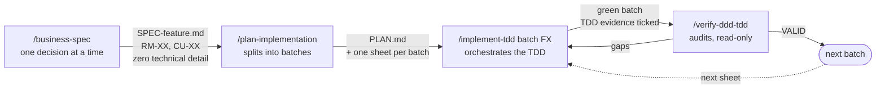
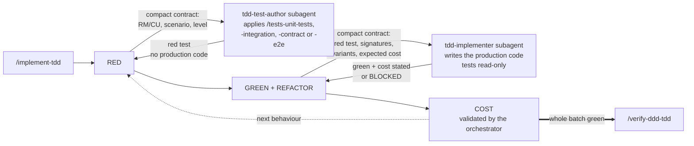

# Claude Code Toolkit

My starting `.claude` folder. What I copy into a new .NET / DDD / clean-architecture repo so that Claude Code works the way I want from the first session: agents, layer rules, hooks, TDD skills, statusline.

No application code here. Nothing to build, nothing to test — only `.md`, `.sh` and JSON.

## How it chains together

Four skills in a chain. Each step produces a file the next one reads — nothing travels through the conversation context, and no step starts without the previous one's artefact.



`/implement-tdd` is not a step but a loop: one full turn per business behaviour, in the order Domain → Application → Infrastructure → WebAPI. Behaviours whose target test files are disjoint are grouped into a **wave**: their REDs go out as several `Agent` calls in a single message. GREEN never parallelises — two implementers on the same layer collide.



Five points carry all the rest:

- **`/implement-tdd` writes neither its tests nor its code.** RED goes to the `tdd-test-author` subagent, allowed to touch test files and nothing else. GREEN and REFACTOR go to `tdd-implementer`, for which test files are read-only: a test that cannot go green without being modified comes back as `BLOCKED` instead of being weakened. The orchestrator produces nothing — it splits, reads the diffs, validates the cost and settles the design.
- **Subagents produce and declare, the orchestrator judges.** That is also what keeps the main context usable over a long batch: build and test logs stay with whoever caused them.
- **The delegation contract names the paths.** Target test file, fixture, handler under test, shared builders: the orchestrator has just read the sheet and holds them, the subagent does not and would pay a full exploration to rebuild them. Any file search is forbidden to it; a missing path comes back as `BLOCKED` and is a plan gap. Same rule on the GREEN side, plus one: a GREEN contract carries the current behaviour only — a guard written ahead turns the next RED green, and the only way out is to strip the code and re-observe the red.
- **`COST` is a phase, not a review.** No test measures the number of Infrastructure calls: green proves nothing on that axis. An `await` on a repository inside a loop goes back to design.
- **`/verify-ddd-tdd` runs before the next batch**, in a fork and with no write access. It audits the delivered code as it is first, and only then its conformance to the plan — the plan is not the ultimate reference, it gets corrected mid-batch. The orchestrator hands it a capture produced by `scripts/audit-capture.sh` (status, diff, coverage, `build` and `ArchitectureTests` exit codes) and the sheet's FX section: the audit opens that once instead of rebuilding it over thirty turns. On a re-audit after correction, `resume` narrows the scope to the previous verdict's deviation table plus the diff produced since — what already carries a verdict is not re-established.

## Not a template to install as-is

This kit encodes **my** way of working, not a universal best practice. Among other things it imposes:

- strict TDD, red test before the code, no exception;
- zero comments in production, XML `///` doc included;
- surgical change — no opportunistic refactor of adjacent code that worked;
- a material ban on committing (the `guard-git.sh` module blocks `add` / `commit` / `push`);
- one `CLAUDE.md` per handler folder, with a business-rules ↔ tests table checked by a hook;
- symbol-discovery `grep`s substituted by `graphify explain` when the AST graph actually answers.

On another project, with other conventions or another tolerance for ceremony, half of these constraints are noise. Taking the kit wholesale mostly leads to fighting it.

The use I recommend: **cherry-pick**. A hook, a path-scoped rule, the structure of a skill, the traceability mechanism. The bricks are independent — except `skills/`, which refers back to `rules/`.

## What is inside

| Folder | Contents | Install target |
|--------|----------|----------------|
| `agents/` | `tdd-test-author` (writes the RED tests), `tdd-implementer` (writes the production code in GREEN), `ddd-tdd-auditor` (audits a batch, read-only) | `<repo>/.claude/agents/` |
| `rules/` | 6 path-scoped rules: `domain`, `application-cqrs`, `infrastructure-ef`, `webapi-endpoints`, `tests`, `markdown-output` (produced vs. instruction files, frozen literals) | `<repo>/.claude/rules/` |
| `docs/` | `CONTEXT-COST.md` (why the cost is quadratic, reading and batching rules, weekly protocol, session hygiene), `TOOLING.md` (RTK, graphify, worktrees, bootstrap). Opened on demand — `CLAUDE.md` keeps the standing rules and points here | `<repo>/.claude/docs/` |
| `hooks/` | 8 hooks: the Bash dispatcher (Git guard, grep → AST-graph substitution, RTK rewrite), `Explore` guard, rules ↔ tests traceability, AST graph resync, context load log, session cleanup | `<repo>/.claude/hooks/` |
| `lib/` | what the hooks call but the harness never invokes: the 4 dispatcher modules, the graph freshness helper, the context log reader | `<repo>/.claude/lib/` |
| `skills/` | 9 skills: the spec → plan → implementation → audit chain, 4 test skills, and the monthly quality report | `<repo>/.claude/skills/` |
| `settings.json` | hook wiring + statusline + base permissions | `<repo>/.claude/` (merge if the file exists) |
| `statusline-command.sh` | git branch, model, context %, effort, 5 h rate limit, caveman badge, graph lag | `<repo>/.claude/` |
| `.gitignore` | the runtime files the hooks write inside `.claude/` | `<repo>/.claude/` (merge if the file exists) |
| `scripts/` | `rules-coverage.py` (rules ↔ traits, repo-wide; `--fix-index` recomputes a feature index's `N rules, M tested` column, `--ids <sheet>` lists the DDD/APP/PERF ids the sheet never cites), `untagged-tests.py` (tests carrying no trait), `migrate-rm-traits.py` (one-shot: `Tests` column → traits), `turn-batching-check.py` (tool-call batching, context fill per tool, `read-bounds` denials and forcings; `--save-baseline` / `--compare` to track a week against a frozen snapshot, `--until` to freeze one before a change goes live), `quality-report-check.py` (arithmetic of a quality report), `audit-capture.sh` (gathers the deterministic audit material — status, diff, RM/CU and DDD/APP/PERF coverage, build, `ArchitectureTests` — into one file, so `/verify-ddd-tdd` opens it once instead of rebuilding it over thirty turns), `install-git-hooks.sh` (installs `.git/hooks/post-checkout`, which links the gitignored `settings.local.json` into every new worktree — only needed when the hook registration was moved out of the committed `settings.json`) | `<repo>/scripts/` |

## Installation

1. **Copy** the folders you want into `<repo>/.claude/`. The skills read `.claude/rules/*.md`: copying `skills/` without `rules/` breaks their references. `scripts/` is the exception: it goes to `<repo>/scripts/`, which is where the hooks and the skills reference it.

   The kit ships the `.gitignore` covering what the hooks write inside `.claude/`: `context-log.tsv`, `context-log.raw.json`, `settings.local.json`. One entry belongs to the repo's own `.gitignore`, one level up: `graphify-out/`, the AST graph rebuilt by `graphify-autosync.sh`.

2. **Wire it up** — copy `settings.json` to `<repo>/.claude/settings.json`, or merge its `hooks` and `statusLine` keys into the existing file. The commands there are written with `$CLAUDE_PROJECT_DIR`, never an absolute path: that is what makes the setup portable.

   The shipped `settings.json` is a shareable template, not a `settings.local.json`: no one-off session grant, no machine path, no `skillOverrides` bound to skills absent from the kit. Its `allow` list covers the strict minimum (`dotnet`, `rtk`, `gh pr`, `python3`, `graphify query|explain|path`, `git check-ignore`). Broad grants — `Bash(rm *)`, `Bash(cd *)` — are deliberately excluded: adding them means letting an agent delete outside its scope.

   Keeping the hooks to yourself instead? Move the `hooks` key to `.claude/settings.local.json` (gitignored) and run `bash scripts/install-git-hooks.sh` once per clone — without it, no project hook fires inside a worktree, since the worktree carries the scripts but not their registration. See `docs/TOOLING.md`.

3. **Substitute `{{PRODUCT}}`** and adapt the points below, otherwise the rules never load and the traceability hook finds nothing.

## Anonymisation

The kit comes from a real repo. The product name has been replaced everywhere by the `{{PRODUCT}}` placeholder:

```
src/{{PRODUCT}}.Domain/          namespace {{PRODUCT}}.Application.Catalog.Products;
tests/{{PRODUCT}}.UnitTests/     dotnet test --project tests/{{PRODUCT}}.UnitTests/…
```

One substitution is enough to make the kit operational:

```bash
grep -rl '{{PRODUCT}}' .claude/ scripts/ | xargs sed -i '' 's/{{PRODUCT}}/MyProduct/g'
```

The code examples rest on a neutral fictional domain — aggregates `Product` and `ModuleDiagram`, sub-entities `ProductItem` and `DiagramNode`, bounded contexts `Catalog` and `Studio`. Nothing there matches an existing project. Rewriting them with the target domain's vocabulary makes the examples more telling, but is not needed to make things work.

## Adaptation points

The kit assumes a repo shaped as `src/{{PRODUCT}}.<Layer>/` + `tests/{{PRODUCT}}.<Suite>/`. Without that shape, adapt at least:

| File | Line(s) | What to change |
|------|---------|----------------|
| `rules/domain.md` | `paths:` frontmatter | Domain project glob |
| `rules/application-cqrs.md` | `paths:` frontmatter | Application project glob |
| `rules/infrastructure-ef.md` | `paths:` frontmatter | Infrastructure + migrations globs |
| `rules/webapi-endpoints.md` | `paths:` frontmatter | WebAPI + public/SDK contract globs |
| `rules/tests.md` | `paths:` frontmatter | tests glob |
| `hooks/handler-claude-md-check.sh` | `APP`, `BOUND_SUITES` | paths of the Application, UnitTests and ContractTests projects |
| `scripts/rules-coverage.py` | `APP`, `BOUND_SUITES` | same paths |
| `scripts/migrate-rm-traits.py` | `APP`, `TESTS` | Application and tests roots; no suite binding, it reads every suite |
| `scripts/untagged-tests.py` | `PRODUCT` | project prefix stripped from the suite name |
| `lib/guard-graphify-grep.sh` | `non_source`, source folder list | the repo's source folders |
| `lib/graphify-freshness.sh` | scanned dirs, extensions | indexed languages and folders |
| `hooks/caveman-skill-ultra.sh` | `case "$skill"` | skills that must force `caveman=ultra` |
| `agents/tdd-test-author.md`, `agents/tdd-implementer.md` | `dotnet test` command | test project path pattern |
| `skills/implement-tdd/references/test-scope.md` | `{{PRODUCT}}`, test environment variable, namespace roots, filter examples | projects, suites actually present, integration test splitting |
| `skills/quality-report/commands-dotnet.md` | `{{PRODUCT}}`, suite list, SonarQube project key, Stryker config names | the suites actually present, the Sonar key, the mutation configs |
| `skills/quality-report/commands-js.md` | Jest config paths, build script, `src/pages` | the front-end layout of the target repo |
| `settings.json` | `permissions.allow` | tools specific to the target repo |
| `skills/*/SKILL.md`, `skills/*/references/*.md` | code examples | namespaces and aggregate names |
| `scripts/audit-capture.sh` | `{{PRODUCT}}.sln`, `ArchitectureTests` project path | solution name and architecture suite of the target repo |
| `docs/TOOLING.md` | `## Bootstrap` section | restore command, `--no-restore` policy, purge, per-OS SDK paths |
| `docs/CONTEXT-COST.md` | the measured figures | re-measure with `turn-batching-check.py`, then create `.claude/context-baseline.json` (`--until <date> --save-baseline`) |
| `rules/markdown-output.md` | language of the produced family | the language the team proofreads; the frozen literals never move |

The `graphify-*` scripts derive the repo root from `dirname "${BASH_SOURCE[0]}"`: no absolute path to fix, but they assume the `.claude/hooks/` and `.claude/lib/` depth — both one level under `.claude/`. Override with `GRAPHIFY_REPO`.

## Hooks

| Hook | Event | Role | Blocking |
|------|-------|------|----------|
| `bash-dispatch.sh` | `PreToolUse:Bash` | single entry point: parses the payload once, then runs `lib/guard-git.sh`, `lib/guard-graphify-grep.sh`, `lib/guard-cat-bounds.sh`, `lib/rewrite-piped-filter.sh` (twice: profiles `graphify-query` then `git-grep`) and `lib/rewrite-rtk.sh` in that order. First module that answers wins, so a substitution is never rewrapped by the RTK rewrite; the two output filters sit before it because `rtk hook claude` has no rewrite of its own for `graphify` or `git grep`. `lib/batching-nudge.sh` runs outside that chain: it decides nothing, and its advice is grafted onto whatever the chain answers | depends on the module |
| `explore-guard.sh` | `PreToolUse:Agent` | delegation guard, three checks in cost order: every `Agent` call carries a `description`; an `Explore`, `general-purpose` or `Plan` spawn mentions graphify in its prompt; the model is chosen rather than inherited — `haiku` required on `Explore`, merely explicit on `general-purpose`, which also writes. When all three pass it appends the report contract to `tool_input.prompt` (caveman-ultra, 20-line cap, 40 for `Plan`, graphify before grep): `additionalContext` would land in the caller's context, only the prompt reaches the agent. Own hook: a spawn costs ~55k startup tokens, a grep ~300, and the agent's final report is re-injected whole into the caller | yes |
| `implement-tdd-guard.sh` | `UserPromptSubmit` + `PreToolUse:Skill` | denies a second `/implement-tdd` launch in a session that already closed a batch — it reads the transcript for the closing literal of the skill (French and English wordings both matched). Correction mode passes. Re-issuing the identical launch passes through; the chained batch would otherwise pay the whole accumulated context of the previous one, measured at 1.9x the input at equal request count | yes, once per closed batch |
| `read-bounds.sh` | `PreToolUse:Read` | denies a `Read` with no `offset`/`limit` on a file past 120 lines (`CLAUDE_READ_BOUNDS_THRESHOLD` to change it), and records the denial per agent. Re-issuing the identical `Read` passes through — that is how a full read is forced; the pass applies to the agent that asked for it, not to its siblings or its parent. Skips images, PDFs and notebooks | yes, once per file and agent |
| `affected-blast-radius.sh` | `PreToolUse:Edit\|Write` | on a Domain aggregate or value object (`*.Domain/*/Aggregates/*.cs`, `.../ValueObjects/*.cs`), runs `graphify affected` on the edited type and injects the per-project rollup as `additionalContext` — never the raw output, 421 lines / 65 kB on a central id against 8 rolled-up lines. Resolves the ambiguity graphify 0.9.58 introduced by path-qualifying node ids, using the edited file as its own disambiguator, and stays silent when the symbol still does not resolve. Once per (agent, symbol) | no |
| `delegation-nudge.sh` | `PreToolUse:Read\|Agent` | counts the distinct `.cs` files the main chain read directly and, past 6 (`CLAUDE_DELEGATION_NUDGE_THRESHOLD`), appends one `additionalContext` nudge towards an `Agent`. Once per session, cancelled by the first `Agent` call; a subagent's own reads never count, since delegation is the outcome wanted. Measured over 180 sessions: 9,091 bytes per `Read` against 1,639 per `Agent` | no |
| `caveman-skill-ultra.sh` | `PreToolUse:Skill` | forces `caveman=ultra` when entering certain skills | no |
| `handler-claude-md-check.sh` | `PostToolUse:Edit\|Write` | cross-checks the `## Règles métier` table of the handler `CLAUDE.md` files against the tests actually present; reports untested rules and orphan tests | no, warning only |
| `graphify-autosync.sh` | `Stop` | rebuilds the graph if the working tree moved. `mkdir` lock, anti-shrink guard (auto `--force` if the drop is ≤ 2 %) | no |
| `worktree-graphify-link.sh` | `SessionStart` | symlinks the main working tree's `graphify-out/` into a linked worktree. graphify resolves its graph only at `<cwd>/graphify-out/graph.json` — no parent lookup, no env var — so `query`, `explain`, `path` and `affected` all fail in a worktree without it. No-op outside a linked worktree | no |
| `session-cleanup.sh` | `SessionStart` | drops this session's substitution and read-denial memories (glob, subagents included), purges what is older than two days | no |
| `context-log.sh` | `InstructionsLoaded` | logs every instruction file entering the context (path, bytes, ~tokens, load reason) into `.claude/context-log.tsv` | no, observes only |

The `lib/` side, which the harness never calls directly:

| File | Called by | Role |
|------|-----------|------|
| `lib/guard-git.sh` | `bash-dispatch.sh` | forbids mutating Git commands (`add`, `commit`, `push`), including through `rtk git`, `git -C`, `cd && git`. Reading stays free; `add -N` and `apply` fall through to `ask` for the worktree hand-back |
| `lib/guard-graphify-grep.sh` | `bash-dispatch.sh` | rewrites a symbol-discovery `grep`/`find`/`rg` into `graphify explain`, but only when the node exists in the graph, the search is not scoped to a subpath, and the symbol was not already substituted in the session. Ignores non-code targets, heredocs and downstream-of-a-pipe filtering |
| `lib/guard-cat-bounds.sh` | `bash-dispatch.sh` | denies a bare `cat` on a file past 120 lines (`CLAUDE_READ_BOUNDS_THRESHOLD`) or 8 kB (`CLAUDE_CAT_BOUNDS_BYTES`) — the byte trigger catches Markdown that wraps at the paragraph, where a line count alone waves an 18 kB report through. `read-bounds.sh` is a `PreToolUse:Read` hook and has no reach over Bash; measured on one .NET batch, `Read` fell to 1 % of the context fill while Bash rose to 85 %. Never fires on a pipe, a redirect, a binary format, or a second identical command from the same agent |
| `lib/bounds-common.sh` | sourced by `read-bounds.sh` and `lib/guard-cat-bounds.sh` | the shared body of the two bound guards: thresholds, the binary and instruction-file skip lists, the per-language outline, and the refusal layout. Extracted 2026-09-11 from ~45 lines duplicated between them — the outline block was identical down to the regexes, differing only in the variable holding the path. Cost was never the point, divergence was, and it had already happened: `guard-cat-bounds` skipped `.zip` and `.nupkg` where `read-bounds` did not, so a `cat` of a package passed while a `Read` of it was denied and handed a text outline of a binary. Callers keep only what genuinely differs: the tool named in the refusal and the two sentences telling the caller how to read a range and how to force | no |
| `lib/rewrite-piped-filter.sh` | `bash-dispatch.sh` | appends a local stdout filter to a command RTK cannot shrink, one profile per filter. `graphify-query` pipes a bare `graphify query` through `lib/graphify-query-filter.sh`, which drops sourceless nodes and `community=X` and collapses `[src=PATH loc=LNN]` to the clickable `PATH:NN` — measured -14 to -30 % across two .NET repos, every source-carrying node preserved; `explain` is left alone, a few hundred bytes with nothing to trim. `git-grep` pipes `git grep` through `lib/git-grep-filter.sh`, which turns the repeated path into a per-file header — lossless, rebuilding `path:NN:content` from the grouped form diffs byte-identical against the raw output, and the gain follows path length against content length (-32 to -48 % on a .NET tree with ~130-character paths, -6 % on this repo). Both fire only when the LAST segment of the command is the bare match, so `cd x && graphify query "y"` counts; any pipe, redirect or substitution leaves the command alone, which is the escape hatch. Merged 2026-09-11 from `rewrite-graphify.sh` and `rewrite-git-grep.sh`: the two differed only by a trigger regex and a filter path |
| `lib/rewrite-rtk.sh` | `bash-dispatch.sh` | strips the `/usr/bin/`, `/bin/`, `/usr/local/bin/` prefix off `grep`/`rg`/`find`/`egrep`/`fgrep`, prefixes `dotnet test|restore|format` with `rtk` in command position (`rtk hook claude` only rewrites `dotnet build`, though the `rtk dotnet` filter accepts all four), then pipes the payload to `rtk hook claude` itself. When rtk answers nothing on an already-prefixed command, the module emits the `updatedInput` decision itself. The kit *is* the RTK rewrite plus the normalisation — a repo installing it needs no global `rtk init -g` |
| `lib/batching-nudge.sh` | `bash-dispatch.sh` | appends one line of `additionalContext` when the last 6 tool-carrying turns each held a single call (`CLAUDE_BATCHING_WINDOW`, `CLAUDE_BATCHING_COOLDOWN`). Never denies, never rewrites. Wired on Bash but reads the transcript, so it counts every tool. Main chain only: a subagent drops its context after ~30 turns, where the same run costs 32x less |
| `lib/graphify-freshness.sh` | autosync + statusline | counts the sources newer than `graph.json`, 20 s TTL cache |
| `lib/context-report.sh` | run by hand | reads the context log back: heaviest files, tokens per load reason. `--session` narrows it to the last session |

### RTK gotchas (verified on rtk 0.42.4)

- **`rtk gain` prints `[warn] No hook installed` even when this hook is active**, and `rtk init --show` prints `[--] Hook: not found`. Both detectors only inspect `~/.claude/settings.json`; a hook declared in a project `.claude/settings.local.json` is invisible to them. Trust the rewrite, not the warning — `echo '{"tool_name":"Bash","tool_input":{"command":"grep -rn foo src"}}' | rtk hook claude` must answer with an `updatedInput` carrying `rtk grep`.
- **The absolute-path bypass is real**, which is what the normalisation buys: fed `/usr/bin/grep -rn foo src`, `rtk hook claude` returns nothing at all, where the bare `grep` gets rewritten.
- **`rtk hook claude` is idempotent** — `rtk git status` comes back unrewritten, so a global RTK hook (`rtk init -g --auto-patch`) and this one never produce `rtk rtk git status`. **Register only one of them anyway.** Both fire on the same `tool_input`, and on a symbol-discovery `grep` the global one answers `rtk grep …` while the dispatcher answers `graphify explain "X"` — two competing `updatedInput` with no defined winner. The dispatcher already performs the RTK rewrite: drop the global hook.
- **Still bypassing**: the `command` builtin. `command grep …` is not stripped by the normalisation.
- `rtk grep` answers with a match count, not the matching lines. Repo-wide it pays; on a single short file it costs a turn to re-read with `awk`.


## Skills

Main chain: `business-spec` → `plan-implementation` → `implement-tdd` → `verify-ddd-tdd`.

| Skill | When |
|-------|------|
| `business-spec` | short, testable business spec, no technical design |
| `plan-implementation` | validated spec → DDD plan split into batches, tracing RM/CU and decisions |
| `implement-tdd` | implements an all-layer batch under strict TDD; delegates RED to `tdd-test-author`, GREEN and REFACTOR to `tdd-implementer` |
| `verify-ddd-tdd` | audits the batch before moving to the next one; runs in a fork on `ddd-tdd-auditor`. `full` widens to the touched boundaries, `resume` re-audits only the deviations of a previous verdict |
| `tests-unit-tests` | handlers/services: business rules, query results, command events |
| `tests-integration-tests` | repositories / persistence, Testcontainers |
| `tests-contract-tests` | public HTTP contract, Verify snapshots |
| `tests-e2e-tests` | lifecycle of at least two operations, never an isolated endpoint |
| `quality-report` | monthly quality snapshot: tests, coverage, SonarQube, Stryker, git activity — .NET or JS/TS |

## What the kit imposes on the repo installing it

**Layer separation** — the Domain depends on nothing (no HTTP, no EF, no DTO). Application orchestrates: load, call the Domain, save the events, return. Infrastructure and WebAPI translate IO and carry no business rule. Resource bounds sit at the WebAPI boundary, never in Domain nor in Application.

**The `rules/*.md` files are the single source of the layer conventions.** They load when a matching file is opened. Naming tables live in the rule of the layer that owns the artefact — nowhere else. Two sources that drift make the choice random.

**Strict TDD** — Red-Green-Refactor. The red test precedes the code, the REFACTOR phase cleans up *then deletes* (a defensive branch made impossible by an invariant, an indirection with a single caller, dead code introduced by the batch).

**Surgical change** — every modified line ties back to the behaviour at hand. No improvement of adjacent code that worked, no renaming or reformatting outside scope, no flexibility "for later". An adjacent bug outside scope is reported, not fixed. `verify-ddd-tdd` audits that axis hunk by hunk: a hunk with no owning RM/CU is a gap, even if it improves the code.

**Zero comments in production**, XML `///` doc included — intent is carried by naming. Pre-existing comments explaining a decision, a constraint or an exception are kept; only touch them within the lines you touch.

**Rules ↔ tests traceability** — every handler folder carries a `CLAUDE.md` with a `## Règles métier` table, and every test declares the rule it covers on itself: `[Trait("RM", "{HandlerFolder}/{RM|RL-xx}")]`. `handler-claude-md-check.sh` checks both directions; `scripts/rules-coverage.py` gives the repo-wide count.

**Never commit to Git.** The user decides when to commit. `lib/guard-git.sh` makes the instruction deterministic.

**Done checklist** — never announce completion without: the relevant tests green, no regression, plan files marked ✅ with a date, the handler's `## Règles métier` table up to date (Tests column included), the parent feature's index `CLAUDE.md` up to date if a handler is added or its intent changes.

**Progressive disclosure inside a skill** — what only one branch or one phase needs lives in its own reference file, read at that point and not before: `correction-mode.md` opens only on a `— correction:` argument, `closing.md` only after the audit verdict. A reference loaded at the top of a skill is carried by every turn of the batch.

**Context discipline** — these are behaviour rules, independent of the domain. They are not shipped by a hook: copy them into the `CLAUDE.md` of the repo installing the kit.

> **Context** — every turn resends everything accumulated: the cost follows the number of turns and the size of what you leave in them.
> - **Independent calls → a single message.** Two `Read`/`Bash`/`Grep` that do not wait on each other, in two turns, pay the accumulation twice. A turn = one billed round trip, not one call. `lib/batching-nudge.sh` says so out loud after 6 mono-call turns in a row — measured on one .NET batch: 110 of 124 tool-carrying turns held a single call, and the three heaviest cost lines of that session all scale with the turn count.
> - **Bounds mandatory past 120 lines or 8 kB** — `read-bounds.sh` (`PreToolUse:Read`) denies an unbounded `Read`, `lib/guard-cat-bounds.sh` an unbounded `cat`. Re-issue the **same** command verbatim to force the full read.
> - An aggregate read whole is ~24k characters carried to the end of the session: locate (`graphify`, `grep -n`) then read the range. Measured on a .NET repo of this shape: `Read` is 30 % of context fill, and only a third of the calls are bounded.
> - 3 files or more to go through → haiku subagent: its reads stay in its own context, only the conclusion comes back.
>
> **Subagents**
> - Read-only exploration (`Explore`, `general-purpose` when searching) → **always `model: haiku`** in the `Agent` call. Without that parameter the agent inherits the parent model: measured at 11× the cost per turn for the same locating work.
> - Writing code, tests, multi-step → default model.
> - **Bound the report in the delegation prompt**: format and max size. An agent's final report is re-injected whole into the main conversation — measured at 27k characters per unbounded `Explore` launch, against 3k for an agent with an imposed format.
> - **Correcting a returned agent: `SendMessage` under 3 turns, a fresh `Agent` beyond.** `SendMessage` resumes the agent with its whole transcript, re-sent on every further turn; an agent stopped at 49 turns carries ~80k of context and every correction turn pays it. A fresh agent restarts at ~17k of preamble plus ~11k of reloaded rules. Measured: a 10-turn correction costs ~850k in continuation against ~350k restarted.
> - **Never delegate a mechanical file operation** (restore from HEAD, add an import to N files, rename, reformat): a Bash loop does it in one turn. Measured on two sessions: a `restore 19 files from HEAD` agent cost 11 turns, an `add an import to 11 files` agent 4 more.
> - **Every `Agent` call carries a `description`.** Anonymous launches were 42 % of the subagent bill over those two sessions — no name is the symptom of a delegation that was never scoped.
>
> **Symbol or relation → graphify; text → grep.** `explain` (what a node is, what it uses, who uses it), `affected` (what breaks if you change it), `path` (how A reaches B), `query` (natural-language question). The graph only holds AST nodes: a literal, an error message, a configuration value, a `.md`/`.json`/`.csproj` are not in it — that is grep. Never chain `grep | grep | head`.
>
> **Session hygiene** — context cost is quadratic in the number of turns: every answer is re-billed as input on every later turn.
> - `/clear` on a phase change — the only mechanism that throws away the accumulated tail. Within the hour, the head (system prompt, tools, `CLAUDE.md`) is read back from cache instead of being rewritten.
> - `/branch` before an uncertain exploration: a 30-turn dead end abandoned in a branch is never carried by the trunk.
> - `/fork` reduces nothing — it copies the conversation into a background session. A throughput tool, not a cost tool.
> - Never let `/compact` fire: it injects ~60k tokens carried to the end ($3.60 on average over 18 sessions, $12.15 at worst). `/clear` with a ten-line brief costs less.
> - The cache expires after an hour of inactivity. Resuming a large session after a long pause for a small question pays the full rewrite of the prefix — measured at $90 over 30 days.

## Dependencies

Only `jq` and `python3` really count. The rest degrades cleanly — and three of these tools are not public, they stay referenced because I use them.

| Tool | Required by | If missing |
|------|-------------|------------|
| `jq` | statusline, `bash-dispatch.sh`, `graphify-autosync.sh`, `session-cleanup.sh` | silent statusline, no grep substitution |
| `python3` | `lib/guard-graphify-grep.sh`, `lib/batching-nudge.sh`, `handler-claude-md-check.sh`, `caveman-skill-ultra.sh`, `context-log.sh`, every script under `scripts/` | inert hooks, exit 0 |
| `graphify` (`~/.local/bin/graphify`) | `lib/guard-graphify-grep.sh`, `affected-blast-radius.sh`, autosync, freshness | no substitution (the module exits 0 in silence); autosync logs "graphify not found, skip" and exits 0 |
| `rtk` | `lib/rewrite-rtk.sh`, prefixed commands in the skills | drop the `rtk ` prefix from the skills, nothing else breaks |
| `caveman` plugin | `caveman-skill-ultra.sh`, statusline badge | flag written with no effect |

Every hook exits 0 when its dependency is missing, except `lib/guard-git.sh`, `explore-guard.sh`, `read-bounds.sh` and `implement-tdd-guard.sh` which block by design. Removing the `graphify-*` scripts, `read-bounds.sh` and `caveman-skill-ultra.sh` from `settings.json` leaves a coherent kit; `bash-dispatch.sh` keeps working with any subset of its modules present.

## Elsewhere

Other repos configuring a coding agent, from other angles: **[RESOURCES.md](RESOURCES.md)**.

## Licence

[MIT](LICENSE). Take what you want, closed-source projects included.
