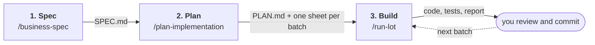
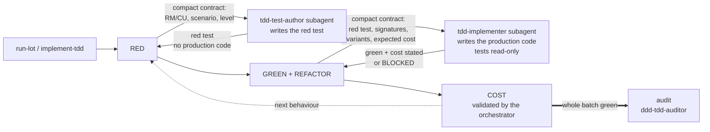

# Claude Code Toolkit

**From a business need to tested, audited code — Claude Code does the work, you make the decisions.**

`cctoolkit` is a Claude Code plugin for DDD / clean-architecture repos. You describe a feature; Claude writes the spec with you, plans it, then builds it batch by batch under strict TDD and audits the result before you commit.

.NET first; Python, Java/Kotlin and TypeScript repos work through their layout and test tags.

## Quick start

```bash
claude plugin marketplace add pierrebelin/claude-code-toolkit --scope project
claude plugin install cctoolkit@cctoolkit --scope project
```

Restart Claude Code, then run **`/cctoolkit:kit-init`**: it reads your repo, asks a few questions and sets everything up.

Requirements, options and what `kit-init` writes: **[INSTALL.md](INSTALL.md)**.

## How it works

Three commands, one per step. Each one writes a file the next one reads.


```mermaid
flowchart LR
    S["<b>1. Spec</b><br/>/business-spec"] -->|SPEC.md| P["<b>2. Plan</b><br/>/plan-implementation"]
    P -->|"PLAN.md + one sheet per batch"| R["<b>3. Build</b><br/>/run-lot"]
    R -->|"code, tests, report"| C(["you review and commit"])
    C -.->|next batch| R
```

1. **`/cctoolkit:business-spec`** — Claude asks you one question at a time, then writes a short business spec: rules, use cases, no technical detail. A second agent tries to poke holes in it.
2. **`/cctoolkit:plan-implementation`** — turns the spec into a technical plan, split into small batches.
3. **`/cctoolkit:run-lot <sheet>`** — builds one batch on its own: tests first, then code, then an audit. Comes back `DONE`, or with what needs your eyes.

Inside `run-lot`, each behaviour of the batch is one loop:


```mermaid
flowchart LR
    I["run-lot / implement-tdd"] --> R
    R["RED"] -->|"compact contract:<br/>RM/CU, scenario, level"| A["tdd-test-author subagent<br/>writes the red test"]
    A -->|"red test<br/>no production code"| R
    R --> G["GREEN + REFACTOR"]
    G -->|"compact contract:<br/>red test, signatures,<br/>invariants, expected cost"| B["tdd-implementer subagent<br/>writes the production code<br/>tests read-only"]
    B -->|"green + cost stated<br/>or BLOCKED"| G
    G --> C["COST<br/>validated by the orchestrator"]
    C -.->|"next behaviour"| R
    C ==>|"whole batch green"| V["audit<br/>ddd-tdd-auditor"]
```

The orchestrator writes neither tests nor code: it splits the work, checks the diffs, validates the cost and settles the design. One agent writes the failing test, another makes it pass without touching it, a third audits.

Commit, `/clear`, next batch. A batch that stops short is finished by hand with `/cctoolkit:implement-tdd` then `/cctoolkit:verify-ddd-tdd` ([`docs/TOOLING.md`](docs/TOOLING.md)).

Want to see the files? **[`examples/`](examples/README.md)** walks one small feature from spec to report.

## Watch a batch run

A batch takes tens of minutes and a dozen agents. The **`run-lot-pane`** mod shows it live inside Claude Code: each phase, which agent is working, the tests going red then green, the cost, and the final verdict.


```bash
claude plugin install run-lot-pane@cctoolkit --scope project
```

Two more mods — a live view of the spec as it's written, and a context meter telling you when to `/clear`: [`mods/README.md`](mods/README.md).

## Opinionated by design

This kit encodes one way of working. It will:

- write the test before the code, every time;
- keep changes surgical — no drive-by refactors;
- tie every business rule to the tests that cover it;
- **never commit** — you decide when.

If your team works differently, half of it will feel like noise. Full list: [`skills/README.md`](skills/README.md#what-the-kit-imposes-on-the-repo).

## Learn more

| | |
|---|---|
| Install, update, dependencies | [INSTALL.md](INSTALL.md) |
| A feature from spec to report | [`examples/`](examples/README.md) |
| Every skill and agent | [`skills/README.md`](skills/README.md) |
| Autonomous runs, finishing a batch by hand | [`docs/TOOLING.md`](docs/TOOLING.md) |
| Layouts and configuration | [`presets/README.md`](presets/README.md) |
| Other repos configuring a coding agent | [RESOURCES.md](RESOURCES.md) |

## Licence

[MIT](LICENSE). Take what you want, closed-source projects included.
