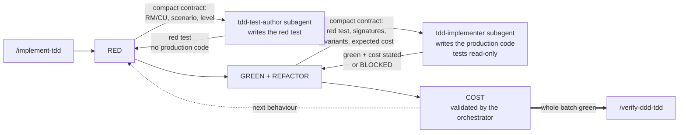

# Claude Code Toolkit

A Claude Code plugin, `cctoolkit`: what I install in a DDD / clean-architecture repo so that Claude Code works the way I want from the first session — TDD skills, their agents, guard and traceability hooks, layout presets, layer rules, statusline. .NET first; the layout and the test tag adapt to Python, Java/Kotlin and TypeScript through `kit.config.json`.

This checkout is both the plugin and its marketplace (`.claude-plugin/`). Nothing to build: only `.md`, `.sh`, Python and JSON.

## Quick start

Two commands, then one skill does the rest:

```bash
claude plugin marketplace add pierrebelin/claude-code-toolkit
claude plugin install cctoolkit@cctoolkit --scope project
```

Restart Claude Code and run **`/cctoolkit:kit-init`**. A plugin cannot ship config, rules or settings — `kit-init` writes them into your repo: it reads your stack, asks one round of questions, and leaves the repo ready for `/cctoolkit:business-spec`. Details: [Installation](#installation).

## Workflow

Four skills in a chain. Each step writes a file the next one reads — nothing travels through the conversation, and no step starts without the previous one's artefact.


```mermaid
flowchart LR
    S["/business-spec<br/>one decision at a time"]
    P["/plan-implementation<br/>splits into batches"]
    I["/implement-tdd batch FX<br/>orchestrates the TDD"]
    V["/verify-ddd-tdd<br/>audits, read-only"]
    N(["next batch"])

    S -->|"SPEC-feature.md<br/>RM-XX, CU-XX<br/>zero technical detail"| P
    P -->|"PLAN.md<br/>+ one sheet per batch"| I
    I -->|"green batch<br/>TDD evidence ticked"| V
    V -->|"VALID"| N
    V -->|"gaps"| I
    N -.->|"next sheet"| I
```

1. **`/cctoolkit:business-spec`** — a short, testable business spec (`RM-xx` rules, `CU-xx` use cases), no technical design. An adversarial reviewer reads it fresh; every `Blocking` open question goes to you.
2. **`/cctoolkit:plan-implementation`** — turns the validated spec into a DDD plan split into batches, one sheet per batch.
3. **`/cctoolkit:implement-tdd batch F1`** — implements one batch under strict TDD, behaviour by behaviour, Domain → Application → Infrastructure → WebAPI.
4. **`/cctoolkit:verify-ddd-tdd`** — read-only audit of the batch before the next one. `VALID` moves on; gaps go back to `/implement-tdd` in correction mode.

Then `/clear` and the next batch.

Inside `/implement-tdd`, each behaviour is one loop:


```mermaid
flowchart LR
    I["/implement-tdd"] --> R
    R["RED"] -->|"compact contract:<br/>RM/CU, scenario, level"| A["tdd-test-author subagent<br/>writes the red test"]
    A -->|"red test<br/>no production code"| R
    R --> G["GREEN + REFACTOR"]
    G -->|"compact contract:<br/>red test, signatures,<br/>invariants, expected cost"| B["tdd-implementer subagent<br/>writes the production code<br/>tests read-only"]
    B -->|"green + cost stated<br/>or BLOCKED"| G
    G --> C["COST<br/>validated by the orchestrator"]
    C -.->|"next behaviour"| R
    C ==>|"whole batch green"| V["/verify-ddd-tdd"]
```

The orchestrator writes neither tests nor code: it splits, reads the diffs, validates the cost and settles the design. How the delegation works: [`skills/README.md`](skills/README.md).

Side skills: `/cctoolkit:quality-report` (monthly snapshot), `/cctoolkit:learn` (turns recurring audit gaps into rules), `/cctoolkit:bulk-read` (a question over named files without loading them).

## Not a template to install as-is

This kit encodes **my** way of working. Among other things it imposes strict TDD, zero comments in production, surgical changes, no `git commit` by the agent, and one rule sheet per handler folder checked against the tests ([`skills/README.md`](skills/README.md#what-the-kit-imposes-on-the-repo)). On a project with other conventions, half of it is noise.

## Installation

Requires Claude Code with plugin support, `jq` and `python3`.

1. **Install the plugin at project scope**, from the repo root — type it yourself, the auto-mode classifier refuses an agent enabling plugins:
   ```bash
   claude plugin marketplace add pierrebelin/claude-code-toolkit
   claude plugin install cctoolkit@cctoolkit --scope project
   ```
   Project scope writes the plugin into the committed `.claude/settings.json`: every clone and worktree gets it. `--scope local` keeps it to your checkout; a worktree then needs `cctoolkit install-git-hooks` (`docs/TOOLING.md`). A local checkout of this repo works as the marketplace too.

2. **Restart Claude Code, then run `/cctoolkit:kit-init`** from the repo root, after `/clear`. This is the step that matters: the plugin brings skills, agents and hooks, but without `kit-init` the repo has no `kit.config.json`, no rules and no permissions, and the hooks assume the `clean-architecture` layout, whatever yours is. Don't set the repo up by hand.

3. **Optional** — the mods (`claude plugin install context-band@cctoolkit --scope project`, same for `tdd-batch`, see [`mods/README.md`](mods/README.md)) and the startup trim ([`templates/README.md`](templates/README.md#startup-trim)). Add `graphify-out/` to the repo's `.gitignore`.

### What `/cctoolkit:kit-init` does

| Step | What happens |
|------|--------------|
| Detect | `cctoolkit detect-stack` and `cctoolkit doctor`: manifests, test framework, product name guess, use-case folders each preset recognises in your tree |
| Migrate | a manual copy of the kit found in `.claude/` → saves its local edits, then removes it on confirmation; the repo's own skills, scripts, config and rules stay. Commit the deletions and the settings change together |
| Choose | one round of questions: the preset (ranked on your real folders), the documents' language, the code language, the product when ambiguous |
| Config | writes `.claude/kit.config.json` — only what differs from the preset — validates it, offers `migrate-anchors` on specs, plans and handler sheets older than the `<!-- kit:… -->` anchors |
| Rules | copies the universal rules and the preset's layer rules into `.claude/rules/`, `{{PRODUCT}}` substituted, dead `paths:` globs rewritten from your layout. **No preset fits?** It drafts one rule per layer from your most-changed files, each convention cited `file:line`, marked "review before trusting" |
| Settings | merges permissions and env into `.claude/settings.json`, installs the statusline, completes `.claude/.gitignore` |
| Report | applies the doctor's mechanical fixes, re-runs `cctoolkit doctor`, prints one summary table and the next step |

It **never overwrites** a file that differs: it shows the difference and asks keep / replace / merge. It **never commits**. Re-run it whenever you want to change the preset or the language, or pull a rule changed by a release. Configuration keys: [`presets/README.md`](presets/README.md).

### Dependencies

`jq` and `python3` are required. The rest degrades cleanly — every hook exits 0 when its tool is missing, except the guards that block by design ([`hooks/README.md`](hooks/README.md)).

| Tool | Used for | If missing |
|------|----------|------------|
| `perl` | `evals/run.sh` timer, `tools/bulk-read`, `tools/doctor` | no latency budget in the evals |
| `claude` CLI, logged in | `cctoolkit bulk-read` | falls back to a bounded read |
| `graphify` | blast radius on aggregate edits, graph autosync | silently skipped |
| `rtk` | output compression of Bash commands | drop the `rtk ` prefix from `kit.config.json` `commands` |
| `caveman` plugin | terse mode forced in some skills | no effect |

## Updating

```bash
claude plugin marketplace update cctoolkit
claude plugin update cctoolkit@cctoolkit
```

Restart Claude Code, then `cctoolkit doctor`. Nothing in the repo changes: `kit.config.json`, `.claude/rules/` and the settings stay as they are. A release changing a rule says so in its notes — re-run `/cctoolkit:kit-init` to pull it: it shows each difference and asks. Never edit the plugin cache (`cctoolkit root`): the next update replaces it. A change to the kit itself goes into a checkout of this repo, then reaches every repo through the update.

## Repository map

| Folder | What | Details |
|--------|------|---------|
| `skills/`, `agents/` | the 12 skills and the 4 subagents they delegate to | [`skills/README.md`](skills/README.md) |
| `hooks/` | guards, bounds, traceability, context nudges, wired in `hooks.json` | [`hooks/README.md`](hooks/README.md) |
| `lib/` | modules the hooks call, config and test-tag readers | [`lib/README.md`](lib/README.md) |
| `scripts/`, `bin/` | repo-wide scanners and one-shots, run as `cctoolkit <name>` | [`scripts/README.md`](scripts/README.md) |
| `tools/` | `bulk-read`, `doctor` | [`tools/README.md`](tools/README.md) |
| `presets/`, `rules/` | layouts, `kit.config.json`, layer and universal rules | [`presets/README.md`](presets/README.md) |
| `templates/` | settings, statusline, `.gitignore` merged into the repo | [`templates/README.md`](templates/README.md) |
| `evals/` | recorded hook cases | [`evals/README.md`](evals/README.md) |
| `mods/` | optional in-terminal panes | [`mods/README.md`](mods/README.md) |
| `docs/` | context cost, tooling | `CONTEXT-COST.md`, `TOOLING.md` |

`agents/` and `rules/` carry no README of their own: the plugin loads every `agents/*.md` as an agent, and `/cctoolkit:kit-init` copies every `rules/*.md` into the repo.

## Elsewhere

Other repos configuring a coding agent: **[RESOURCES.md](RESOURCES.md)**.

## Licence

[MIT](LICENSE). Take what you want, closed-source projects included.
