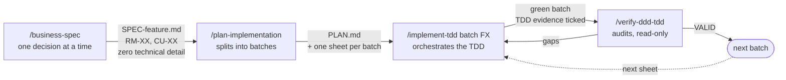
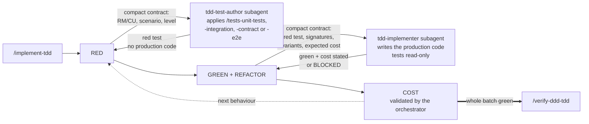

# Claude Code Toolkit

A Claude Code plugin, `cctoolkit`: what I install in a DDD / clean-architecture repo so that Claude Code works the way I want from the first session — TDD skills, their agents, the guard and traceability hooks, layout presets, layer rules, statusline. .NET first; the layout and the test tag adapt to Python, Java/Kotlin and TypeScript through `kit.config.json`.

No application code here. Nothing to build, nothing to test — only `.md`, `.sh`, Python and JSON. This checkout is both the plugin and its marketplace (`.claude-plugin/`).

## How it chains together

Four skills in a chain. Each step produces a file the next one reads — nothing travels through the conversation context, and no step starts without the previous one's artefact.


```mermaid
flowchart LR
    S["/business-spec<br/>one decision at a time"]
    P["/plan-implementation<br/>splits into batches"]
    I["/implement-tdd batch FX<br/>orchestrates the TDD"]
    V["/verify-ddd-tdd<br/>audits, read-only"]
    N(["next batch"])

    S -->|"SPEC-feature.md<br/>RM-XX, CU-XX<br/>zero technical detail"| P
    P -->|"PLAN.md<br/>+ one sheet per batch"| I
    I -->|"green batch<br/>TDD evidence ticked"| V
    V -->|"VALID"| N
    V -->|"gaps"| I
    N -.->|"next sheet"| I
```

`/implement-tdd` is not a step but a loop: one full turn per business behaviour, in the order Domain → Application → Infrastructure → WebAPI. Behaviours whose target test files are disjoint are grouped into a **wave**: their REDs go out as several `Agent` calls in a single message. GREEN never parallelises — two implementers on the same layer collide.


```mermaid
flowchart LR
    I["/implement-tdd"] --> R
    R["RED"] -->|"compact contract:<br/>RM/CU, scenario, level"| A["tdd-test-author subagent<br/>applies /tests-unit-tests,<br/>-integration, -contract or -e2e"]
    A -->|"red test<br/>no production code"| R
    R --> G["GREEN + REFACTOR"]
    G -->|"compact contract:<br/>red test, signatures,<br/>invariants, expected cost"| B["tdd-implementer subagent<br/>writes the production code<br/>tests read-only"]
    B -->|"green + cost stated<br/>or BLOCKED"| G
    G --> C["COST<br/>validated by the orchestrator"]
    C -.->|"next behaviour"| R
    C ==>|"whole batch green"| V["/verify-ddd-tdd"]
```

Five points carry all the rest:

- **`/implement-tdd` writes neither its tests nor its code.** RED goes to the `tdd-test-author` subagent, allowed to touch test files and nothing else. GREEN and REFACTOR go to `tdd-implementer`, for which test files are read-only: a test that cannot go green without being modified comes back as `BLOCKED` instead of being weakened. The orchestrator produces nothing — it splits, reads the diffs, validates the cost and settles the design.
- **Subagents produce and declare, the orchestrator judges.** That is also what keeps the main context usable over a long batch: build and test logs stay with whoever caused them.
- **The delegation contract names the paths.** Target test file, fixture, handler under test, shared builders: the orchestrator has just read the sheet and holds them, the subagent does not and would pay a full exploration to rebuild them. Any file search is forbidden to it; a missing path comes back as `BLOCKED` and is a plan gap. Same rule on the GREEN side, plus one: a GREEN contract carries the current behaviour only — a guard written ahead turns the next RED green, and the only way out is to strip the code and re-observe the red.
- **`COST` is a phase, not a review.** No test measures the number of Infrastructure calls: green proves nothing on that axis. An `await` on a repository inside a loop goes back to design.
- **`/verify-ddd-tdd` runs before the next batch**, in a fork and with no write access. It audits the delivered code as it is first, and only then its conformance to the plan — the plan is not the ultimate reference, it gets corrected mid-batch. The orchestrator hands it a capture produced by `scripts/audit-capture.sh` (status, diff, coverage, `build` and `ArchitectureTests` exit codes) and the sheet's FX section: the audit opens that once instead of rebuilding it over thirty turns. On a re-audit after correction, `resume` narrows the scope to the previous verdict's deviation table plus the diff produced since — what already carries a verdict is not re-established.

## Not a template to install as-is

This kit encodes **my** way of working, not a universal best practice. Among other things it imposes:

- strict TDD, red test before the code, no exception;
- zero comments in production, XML `///` doc included;
- surgical change — no opportunistic refactor of adjacent code that worked;
- a material ban on committing (the `guard-git.sh` module blocks `add` / `commit` / `push`);
- one `CLAUDE.md` per handler folder, with a business-rules ↔ tests table checked by a hook;
- symbol-discovery `grep`s substituted by `graphify explain` when the AST graph actually answers.

On another project, with other conventions or another tolerance for ceremony, half of these constraints are noise. Taking the kit wholesale mostly leads to fighting it.

Installed, the plugin comes whole: skills, agents and hooks load together, and the skills lean on the hooks and on `cctoolkit`. Taking only part of it means reading the source and copying a hook, a rule or a skill structure into your own setup — the bricks are readable on their own, but nothing here maintains a partial copy.

## What is inside

Plugin = shipped by the plugin, read from its cache (`cctoolkit root`), replaced on every update. Repo = written into the repo by `/cctoolkit:kit-init`, the repo's own from then on.

| Folder | Contents | Lives in |
|--------|----------|----------|
| `.claude-plugin/` | `plugin.json` (the `cctoolkit` plugin) and `marketplace.json` (the `cctoolkit` marketplace: `cctoolkit` plus the two mods) | — |
| `agents/` | `tdd-test-author` (writes the RED tests), `tdd-implementer` (writes the production code in GREEN), `ddd-tdd-auditor` (audits a batch, read-only), `adversarial-reviewer` (tries to refute a spec, a plan or the next batch sheet before any code, read-only; returns closed questions ranked `Blocking` / `Major`). Namespaced once installed: `cctoolkit:tdd-implementer` | plugin |
| `skills/` | 12 skills: the spec → plan → implementation → audit chain, 4 test skills, the monthly quality report, `bulk-read`, `learn` and `kit-init`. Namespaced: `/cctoolkit:implement-tdd` | plugin |
| `hooks/` | `hooks.json` (the wiring, commands under `${CLAUDE_PLUGIN_ROOT}`) and 13 hooks: the Bash dispatcher (Git guard, `cat`/`diff` bounds, integration-suite filter, output filters, RTK rewrite), `Agent` guard, `Read` bounds, `/implement-tdd` relaunch and effort guard, aggregate blast radius, caveman forcing, rules ↔ tests traceability, subagent report shape, AST graph resync, worktree graph link, context load log, session cleanup, replayed-context step nudge | plugin |
| `lib/` | what the hooks call but the harness never invokes: the 6 dispatcher modules and their two output filters, the batching nudge, the shared bound body, the delegation nudge, the graph freshness helper, the context log reader; `project-root.sh` and `kit_config.py` (the repo the kit serves, `kit.config.json` resolved over its preset — the one reader every hook and script goes through) and `kit_testtag.py` (the `testTag` adapters: xUnit, pytest, JUnit, Jest) | plugin |
| `bin/` | `cctoolkit` — on the Bash tool's `PATH` while the plugin is enabled; `cctoolkit <script>` runs `scripts/<script>`, `cctoolkit doctor` / `bulk-read` the tools, `cctoolkit list` every command, `cctoolkit root` the plugin directory | plugin |
| `scripts/` | repo-wide scanners and one-shots, run through `cctoolkit <name>`: `detect-stack` (stack, test framework, product, and how many use-case folders each preset recognises — the model-free half of `/kit-init`), `rules-coverage` (rules ↔ tags, repo-wide; `--ids <sheet>` lists the DDD/APP/PERF ids the sheet never cites), `untagged-tests`, `migrate-rm-traits` (one-shot: `Tests` column → tags), `migrate-anchors` (one-shot: appends the `<!-- kit:… -->` anchors to documents written before them — dry run by default, `--apply` writes), `turn-batching-check` (tool-call batching, context fill per tool, `read-bounds` denials; `--save-baseline` / `--compare`), `quality-report-check`, `audit-capture` (the deterministic audit material in one file, so `/verify-ddd-tdd` opens it once), `pre-audit` (the mechanical gate before `/verify-ddd-tdd` — red means no fork), `access-cost` (awaited Infrastructure calls read off the syntax tree with ast-grep; C# only), `install-git-hooks` (links `settings.local.json` into new worktrees, for a plugin enabled at local scope), `batch-wallclock` (wall clock of an `/implement-tdd` batch), `kit-diff <repo>` (a manual copy against the kit: MISSING / ADDED / DRIFT / MERGED, plus anonymisation alerts — the migration's first step), `learn-candidates` (the model-free half of `/learn`) | plugin |
| `tools/` | `bulk-read` (one-shot, tool-less haiku worker answering a question over files you can already name — ~500 fixed tokens, the files never enter the calling context), `doctor` (read-only readiness check: binaries, plugin enablement, hook wiring, manual-copy leftovers, rules, config, git hook, graph, worker login, `/tmp` leftovers, `/learn` backlog as a `NOTE`; runs `--quiet` on `SessionStart`, silent when healthy save for that `NOTE`) | plugin |
| `presets/` | one folder per layout: `preset.json` pre-fills `layout`, `testTag` and `commands` of `kit.config.json` — `clean-architecture` (the default, the kit's original shape), `vertical-slices`, `hexagonal`. `clean-architecture/rules/` is its layer pack: `domain`, `application-cqrs`, `infrastructure-ef`, `webapi-endpoints`, `tests`. A repo's own preset goes in `<repo>/.claude/presets/<name>/` and wins over a shipped one of the same name | plugin; a pack's `rules/` copied into the repo |
| `rules/` | the 3 universal rules, whatever the stack: `cctoolkit` (how to read the kit's instructions: `{{PRODUCT}}`, `cctoolkit`, kit paths, namespacing), `markdown-output` (produced vs. instruction files, language, frozen literals) and `context-discipline` (turns, bounds, subagents, session hygiene). A plugin cannot load rules: `/kit-init` copies them. Once copied, `.claude/rules/` is the repo's own — the core never parses it | repo, `.claude/rules/` |
| `templates/` | what a plugin cannot set: `settings.json` (permissions, env, statusline, the marketplace and plugin enablement — merged into the repo's), `statusline-command.sh` (git branch, model, context %, effort, 5 h rate limit, caveman badge, graph lag; also drops the current effort in `$TMPDIR` for `implement-tdd-guard.sh`), `claude.gitignore` (the runtime files the hooks write inside `.claude/`), `settings.local.json` (startup trim, opt-in) | repo, `.claude/` |
| `docs/` | `CONTEXT-COST.md` (why the cost is quadratic, reading and batching rules, weekly protocol, session hygiene), `TOOLING.md` (RTK, graphify, worktrees, bootstrap). Opened on demand | plugin |
| `evals/` | `run.sh` + `cases/*.json`: recorded hook payloads replayed through the hooks, checking the decision, the rewritten command, the appended prompt or the injected context (~30 s), from this checkout or with `cctoolkit evals`. Every hook case is also timed (`LATENCY_MAX_MS`, 80 ms by default; `LATENCY_SLOW_HOOKS` for the per-hook exceptions). Every defect found in production is a case; a hook change without a case is not finished | plugin |
| `mods/` | 2 mods — function-hook plugins drawn inside Claude Code: `context-band` (band above the prompt: context trend, 150k step and 250k ceiling, cache expiry, single-call turns, top contributions, graph rebuild), `tdd-batch` (live pane of the `/implement-tdd` batch sheet). Separate plugins of the same marketplace, optional. See `mods/README.md` | plugins `context-band`, `tdd-batch` |
| `kit.config.json` | not shipped: everything a repo has of its own — `language`, `preset`, `product`, `layout` overrides, `testTag`, `commands` — see [`kit.config.json`](#kitconfigjson). Written by `/kit-init` | repo, `.claude/kit.config.json` |

## Installation

Requires Claude Code with plugin support, `jq` and `python3` (see [Dependencies](#dependencies)).

1. **Add the marketplace and install the plugin, at project scope** — from the repo root:
   ```bash
   claude plugin marketplace add pierrebelin/claude-code-toolkit
   claude plugin install cctoolkit@cctoolkit --scope project
   ```
   or `/plugin marketplace add pierrebelin/claude-code-toolkit` then `/plugin install cctoolkit@cctoolkit` inside a session. Project scope writes `extraKnownMarketplaces` and `enabledPlugins` into the committed `.claude/settings.json`: every clone and every worktree gets the plugin, and teammates are offered the marketplace on their first session. Type these yourself — the auto-mode classifier refuses an agent enabling plugins. `--scope local` keeps it to your checkout (`.claude/settings.local.json`); a worktree then needs `cctoolkit install-git-hooks` (`docs/TOOLING.md`). A local checkout of the toolkit works as the marketplace too: `claude plugin marketplace add /path/to/claude-code-toolkit`.

2. **Restart Claude Code, then run `/cctoolkit:kit-init`.** It detects the stack (`*.sln` / `*.csproj`, `package.json`, `pyproject.toml`, `pom.xml` / `build.gradle`, the test framework, the product name), ranks the presets by how many use-case folders each recognises in the tree, asks the preset, the documents' language and the product, writes `.claude/kit.config.json`, copies the universal rules and the preset's layer pack into `.claude/rules/` with `{{PRODUCT}}` substituted — or, when no preset fits, drafts one `.claude/rules/<layer>.md` per code folder from what the files actually share, to review. It merges `templates/settings.json` into `.claude/settings.json` (permissions, env, statusline), installs the statusline and the `.gitignore` entries, never overwrites a file without asking, then runs `cctoolkit doctor` and reports. Re-run it to reconfigure.

   The shipped `templates/settings.json` is a shareable template: no one-off session grant, no machine path. Its `allow` list covers the strict minimum (`Edit`, `WebSearch`, `cctoolkit`, `dotnet`, `rtk`, `gh pr`, `xargs`, `python3`, `graphify query|explain|path`, `git check-ignore`). Broad grants — `Bash(rm *)`, `Bash(cd *)` — are deliberately excluded.

3. **Enable the mods** (optional) — `claude plugin install context-band@cctoolkit --scope project`, same for `tdd-batch`. See `mods/README.md`.

4. **Trim the startup** (optional) — merge the four keys of `templates/settings.local.json` into `<repo>/.claude/settings.local.json` (create it if missing; it is gitignored). Use the `Edit` tool, never a script: the auto-mode classifier refuses a script on that file. The `syncClaudeAi*` keys are never read from `.claude/settings.json`, only from `settings.local.json` or the user settings.

   | Key | Drops | Keep it off when |
   |---|---|---|
   | `disableClaudeAiConnectors` | every claude.ai MCP connector — all or nothing | the repo relies on one of them |
   | `syncClaudeAiSkills: false` | the synced `anthropic-skills:*` (docx, pdf, xlsx, pptx, browser…) — `skillOverrides` does not reach them | a skill or spec flow produces or reads those formats |
   | `syncClaudeAiPlugins: false` | the synced plugins (`cowork-plugin-management`) | a workflow uses them |
   | `disableWorkflows` | the `Workflow` tool (~5k tokens), and with it the `ultracode` keyword | the repo uses either |

   Check usage before cutting: a key whose feature the repo depends on stays out. Measure from the repo root before and after, then validate the file with `python3 -m json.tool .claude/settings.local.json`:
   ```bash
   claude -p "ok" --output-format json --max-turns 1 </dev/null \
     | python3 -c "import json,sys;u=json.load(sys.stdin)['usage'];print(u.get('input_tokens',0)+u.get('cache_creation_input_tokens',0)+u.get('cache_read_input_tokens',0))"
   ```
   Measured on a .NET repo of this shape: 35.4k → 22.6k tokens per `claude -p` startup (−36 %), reloaded on every `/clear`.

A repo already holding handler `CLAUDE.md` files, specs or plans written before the anchors runs `cctoolkit migrate-anchors` (dry run), checks the report, then `--apply`: until then the parsers see none of those documents. The AST graph lives in `graphify-out/`, at the repo root: add it to the repo's own `.gitignore`.

## Updating

```bash
claude plugin marketplace update cctoolkit
claude plugin update cctoolkit@cctoolkit
```

or `/plugin marketplace update cctoolkit` in a session; enable auto-update for the marketplace in `/plugin` to skip it. Restart Claude Code: skills, agents and hooks load from the new version's cache directory, the previous one is dropped. Nothing in the repo changes — `kit.config.json`, `.claude/rules/` and the merged settings stay as they are.

Then `cctoolkit doctor`. A new key or preset shows there; a release that changes a universal rule or a layer pack says so in its notes — the repo's copies are its own, so pull the change with `/cctoolkit:kit-init` (it shows each difference and asks) or by hand. Never edit the plugin's cache (`cctoolkit root`): the next update replaces it. A change to the kit itself goes into a checkout of this repo, then reaches every repo through the update.

## Migrating from a manual copy

A repo set up before the plugin holds the kit in `.claude/{agents,hooks,lib,presets,skills,tools,evals,docs}`, `scripts/` at the root, and its hook registrations in `.claude/settings.json` (or `settings.local.json`) as `bash $CLAUDE_PROJECT_DIR/.claude/hooks/…`. Left beside the plugin, every guard fires twice and the bare skill names (`/implement-tdd`) shadow the plugin's. In order:

1. **Save what the copy changed.** From the repo: `cctoolkit kit-diff .` (or `bash scripts/kit-diff.sh <repo>` from a toolkit checkout). `DRIFT` and `ADDED` lines are local edits to the core; `MERGED` lines are the settings, `.gitignore` and statusline, which stay in the repo. Bring each edit worth keeping into the toolkit repo — `kit-diff` flags any line naming the repo's product or vocabulary first — or drop it knowingly.
2. **Install the plugin** — [Installation](#installation) step 1.
3. **Remove the copy.** `/cctoolkit:kit-init` does it on confirmation: it sees the copy (`legacyCopy`), runs step 1 for you, and deletes the kit folders under `.claude/`, the kit's scripts under `scripts/` (only those `cctoolkit list` names) and the `hooks` key of the settings files. By hand: `git rm -r` those folders and scripts, delete the `hooks` key — the plugin's `hooks/hooks.json` replaces it — and keep `statusLine`, `permissions`, `env`.
4. **Keep the repo's own files.** `.claude/kit.config.json`, `.claude/rules/*.md` and `.claude/statusline-command.sh` stay. `/kit-init` adds the missing universal rule `cctoolkit.md`, without which the model reads `{{PRODUCT}}` in the kit's commands literally. Former `.claude/mods/` (marketplace `pierrebelinmods`): delete the folder and its two settings entries, then enable `context-band@cctoolkit` and `tdd-batch@cctoolkit`.
5. **Check**: `cctoolkit doctor` — no `legacy copy` nor `legacy hook wiring` line, `plugin enabled` ok, every hook script present. Then one session: `/cctoolkit:implement-tdd` and the agents answer under their namespaced names.

Commit the deletions and the settings change together: a clone that gets one without the other runs either no guard or two.

## `kit.config.json`

One file, `<repo>/.claude/kit.config.json`, one user per repo — no `.local` variant. Everything a repo has of its own lives there or in `.claude/rules/`; the core files stay identical to the kit's. Missing file or key = the preset's value; missing `preset` = `clean-architecture`, the kit's original behaviour.

```json
{
  "language": { "docs": "fr", "code": "en" },
  "preset": "clean-architecture",
  "product": "MyProduct"
}
```

A repo of another shape names its preset and overrides only what differs — objects merge key by key, a list or a string replaces the preset's:

```json
{
  "preset": "vertical-slices",
  "testTag": { "framework": "pytest" },
  "layout": { "tests": { "bound": ["src/Features"] } },
  "commands": { "test": "pytest {suite}" }
}
```

| Key | Default | Governs | Never moves |
|---|---|---|---|
| `language.docs` | `en` | prose and headings of what the skills write for people: specs, plans, batch sheets, handler and feature `CLAUDE.md`, reports, summaries | the `<!-- kit:… -->` anchors, ids (`RM-xx`, `DDD-nn`…), status tokens, values quoted verbatim (`Blocking`) |
| `language.code` | `en` | test names, code comments, identifiers the model chooses | the keywords of a naming pattern (`Should…_When…`) and the layer conventions of `rules/` |
| `preset` | `clean-architecture` | which `presets/<name>/preset.json` pre-fills `layout`, `testTag`, `commands` | — |
| `product` | unset | `{product}` in every path and command below. Unset, it expands to `*`: `src/*.Application` finds the one Application project a repo usually has — set it as soon as there are two | — |
| `layout.sources` | `src`, `.cs`, `//` | `roots`, `extensions` and comment prefix (`comment`: a string, or one per extension) of production code — the scope of `pre-audit.sh`'s comment and scope checks | — |
| `layout.aggregate` | `*/*.Domain/*/Aggregates/*.cs`, `…/ValueObjects/*.cs` | where an aggregate and its value objects live — shell-`case` patterns on the full path, read by `affected-blast-radius.sh` | — |
| `layout.useCase` | `src/{product}.Application`, `*Handler.cs` holding a `class …Handler` | `roots` where use cases live, `marker` (`file` glob + `contains` regex) recognising a use-case folder at any depth, `label` naming them in the reports | — |
| `layout.ruleSheet` | `CLAUDE.md` | the rule sheet's file name, in the use-case folder | its `kit:rules` / `kit:flow` / `kit:events` anchors |
| `layout.tests` | `tests`; bound `tests/{product}.UnitTests`, `…ContractTests`; interaction `tests/*.UnitTests`, `tests/*.CoreTests` | `roots` scanned for tests, `bound` suites where every test cites a rule (`UNBOUND TEST`), `interaction` suites checked for spy assertions by `pre-audit.sh` | — |
| `layout.skipDirs` | `bin`, `obj`, `Properties`… | folders never walked | — |
| `testTag.framework` | `xunit` | the carrier of the rule tag: `xunit` `[Trait("RM", "F/RM-01")]`, `pytest` `@pytest.mark.rm("F/RM-01")`, `junit` `@Tag("RM:F/RM-01")`, `jest` `[RM F/RM-01]` in an `it`/`test`/`describe` title (a `describe` tag covers its tests) | the value `<SheetFolder>/<RM\|RL-xx>` |
| `testTag.regex`, `testTag.files` | the adapter's | carrier regex (one capture group: the value), test file globs | — |
| `commands.build`, `commands.architectureTest` | `rtk dotnet build {product}.sln --no-restore`; the `ArchitectureTests` run and its `when` path regex | what `audit-capture.sh` runs; empty = section reported "not run" | — |
| `commands.test` | `rtk dotnet test --project tests/{product}.{suite}/…` | the suite command template — validated by the doctor, not yet read by the skills (run 3) | — |

Path patterns are segment globs relative to the repo root (`*` stays inside one folder), `layout.aggregate` excepted. The presets: `clean-architecture` (projects per layer), `vertical-slices` (one folder per feature under `src/Features`, holding handler, sheet and unit tests; markers for C#, Python, Java/Kotlin, TypeScript), `hexagonal` (`src/domain`, `src/application`, `src/adapters`; same markers). Only `clean-architecture` ships a layer pack today.

`cctoolkit doctor` validates the file: JSON, keys, preset, regexes, `testTag`, and whether each root matches a directory. A hook never reports a broken config — it exits 0 in silence; the doctor is where that shows.

Any language code works: the model reads the value through `rules/markdown-output.md`, no list to maintain. The kit's own instructions (`skills/`, `agents/`, `rules/`) and the contracts between agents (`## RED`, `## Verdict — GAPS`…) stay English whatever the setting.

**Why anchors.** A parsed heading ends with an invisible HTML comment — `## Règles métier <!-- kit:rules -->` under `"docs": "fr"`, `## Business rules <!-- kit:rules -->` under `"en"`. Hooks and scripts match the anchor, never the title, so a translated document stays machine-readable. Parsed tables carry a schema anchor (`<!-- kit:cols id,rule,outcome -->`) and are read by position. The list of anchors and of their parsers: `rules/markdown-output.md` § Frozen literals.

## Anonymisation

The kit comes from a real repo. The product name has been replaced everywhere by the `{{PRODUCT}}` placeholder:

```
src/{{PRODUCT}}.Domain/          namespace {{PRODUCT}}.Application.Catalog.Products;
tests/{{PRODUCT}}.UnitTests/     dotnet test --project tests/{{PRODUCT}}.UnitTests/…
```

Hooks, `lib/` and `scripts/` read it from `kit.config.json` `product` and carry no placeholder. The skills, agents and references keep it — they live in the plugin cache, shared by every repo — and the universal rule `cctoolkit.md` tells the model to read `{{PRODUCT}}` as `product`. Only the rules copied into a repo by `/kit-init` have it substituted.

`scripts/kit-diff.sh` replays that substitution before comparing a manual copy, so it is not a drift. Before a change flows back from a repo into the kit, the same script flags any line naming the repo's product or vocabulary (use-case folders and their parents, aggregate and value-object names read through its `layout`).

The code examples rest on a neutral fictional domain — aggregates `Product` and `ModuleDiagram`, sub-entities `ProductItem` and `DiagramNode`, bounded contexts `Catalog` and `Studio`. Nothing there matches an existing project. Rewriting them with the target domain's vocabulary makes the examples more telling, but is not needed to make things work.

## Adaptation points

Paths, markers, the tag carrier and the build commands are `kit.config.json`; the layer conventions are the repo's `.claude/rules/`. Everything else ships in the plugin: changing it means changing the kit — in a fork of this repo, published as your own marketplace — never the plugin cache. What the config cannot express yet:

| File | Line(s) | What to change |
|------|---------|----------------|
| `.claude/rules/*.md` (repo) | `paths:` frontmatter, content | the globs and conventions of each layer — the repo's own files, rewritten freely |
| `.claude/settings.json` (repo) | `permissions.allow` | tools specific to the target repo |
| `lib/graphify-freshness.sh` | scanned dirs, extensions | indexed languages and folders |
| `hooks/caveman-skill-ultra.sh` | `case` on the skill | skills that must force `caveman=ultra` |
| `lib/guard-integration-filter.sh` | `dotnet test`, `IntegrationTests` | the slow suite and its filter flags — inert on another stack |
| `agents/tdd-test-author.md`, `agents/tdd-implementer.md` | `dotnet test` command | test project path pattern |
| `skills/implement-tdd/references/test-scope.md` | test environment variable, namespace roots, filter examples | projects, suites actually present, integration test splitting |
| `skills/quality-report/commands-dotnet.md`, `commands-js.md` | suite list, SonarQube project key, Stryker config names; Jest config paths | the suites and front-end layout actually present |
| `skills/*/SKILL.md`, `skills/*/references/*.md` | code examples | namespaces and aggregate names |
| `scripts/access-cost.py` | `.cs`, the ast-grep rules under `scripts/access-cost/` | C# only |
| `scripts/pre-audit.sh` § 7 | `Assert.…(_fixture.…Repository…)`, `Received/CallCount/Called` | the spy and double-state idioms of the test framework; the suites it reads are `layout.tests.interaction` |
| `docs/TOOLING.md` | `## Bootstrap` section | restore command, `--no-restore` policy, purge, per-OS SDK paths |
| `docs/CONTEXT-COST.md` | the measured figures | re-measure with `cctoolkit turn-batching-check`, then create `.claude/context-baseline.json` (`--until <date> --save-baseline`) |

Every hook and script resolves the repo through `lib/project-root.sh` / `kit_config.project_root()` — `$CLAUDE_PROJECT_DIR`, else the git top level of the working directory — never from its own location. The `graphify-*` scripts accept `GRAPHIFY_REPO` to target another checkout.

## Hooks

| Hook | Event | Role | Blocking |
|------|-------|------|----------|
| `bash-dispatch.sh` | `PreToolUse:Bash` | single entry point: parses the payload once, then runs `lib/guard-git.sh`, `lib/guard-cat-bounds.sh`, `lib/guard-diff-bounds.sh`, `lib/guard-integration-filter.sh`, `lib/rewrite-piped-filter.sh` (twice: profiles `graphify-query` then `git-grep`) and `lib/rewrite-rtk.sh` in that order. First module that answers wins, so a rewrite is never rewrapped by the RTK rewrite; `lib/guard-graphify-grep.sh` sat in second position until 2026-09-13 — it ran `graphify explain` on every symbol-looking grep to decide, 2.25 s a call for one substitution over 60 sessions; the two output filters sit before it because `rtk hook claude` has no rewrite of its own for `graphify` or `git grep`. `lib/batching-nudge.sh` runs outside that chain: it decides nothing, and its advice is grafted onto whatever the chain answers | depends on the module |
| `explore-guard.sh` | `PreToolUse:Agent` | delegation guard, two checks in cost order: every `Agent` call carries a `description`; the model is chosen rather than inherited — `haiku` required on `Explore`, merely explicit on `general-purpose`, which also writes. Since 2026-09-17 the check reaches every spawn: a call with no `subagent_type` is read as `general-purpose` — it used to fall through the type filter and inherit Opus, which is where the mechanical refactors were billed — and a custom agent is asked for a model unless its own file pins `model:` in frontmatter. When both pass it appends the report contract to `tool_input.prompt` (caveman-ultra, 20-line cap, 40 for `Plan`): `additionalContext` would land in the caller's context, only the prompt reaches the agent. Own hook: a spawn costs ~55k startup tokens, a grep ~300, and the agent's final report is re-injected whole into the caller | yes |
| `implement-tdd-guard.sh` | `UserPromptSubmit` + `PreToolUse:Skill` | denies a second `/implement-tdd` launch in a session that already closed a batch — it reads the transcript for the closing literal of the skill (French and English wordings both matched). Correction mode passes. Re-issuing the identical launch passes through; the chained batch would otherwise pay the whole accumulated context of the previous one, measured at 1.9x the input at equal request count. Also denies a launch at effort `high`, `xhigh` or `max`, reading the level the statusline dropped in `$TMPDIR`: the orchestrator runs 100 to 180 turns at 8.6 s each there, and only `/effort` can change it | yes, once per closed batch and once per launch at too high an effort |
| `read-bounds.sh` | `PreToolUse:Read` | denies a `Read` with no `offset`/`limit` on a file past 120 lines or 8 kB (`CLAUDE_READ_BOUNDS_THRESHOLD`, `CLAUDE_CAT_BOUNDS_BYTES`), and records the denial per agent. The refusal names `cctoolkit bulk-read` as the third way out, for a question about the file rather than an edit. Re-issuing the identical `Read` passes through — that is how a full read is forced; the pass applies to the agent that asked for it, not to its siblings or its parent. Skips images, PDFs and notebooks. On the reads it lets through it sources `lib/delegation-nudge.sh`, which counts them | yes, once per file and agent |
| `affected-blast-radius.sh` | `PreToolUse:Edit\|Write` | on a Domain aggregate or value object (`layout.aggregate`; clean-architecture: `*.Domain/*/Aggregates/*.cs`, `.../ValueObjects/*.cs`), runs `graphify affected` on the edited type and injects the per-project rollup as `additionalContext` — never the raw output, 421 lines / 65 kB on a central id against 8 rolled-up lines. Resolves the ambiguity graphify 0.9.58 introduced by path-qualifying node ids, using the edited file as its own disambiguator, and stays silent when the symbol still does not resolve. Once per (agent, symbol) | no |
| `caveman-skill-ultra.sh` | `PreToolUse:Skill` | forces `caveman=ultra` when entering certain skills | no |
| `handler-claude-md-check.sh` | `PostToolUse:Edit\|Write` | cross-checks the rules table (`kit:rules`) of the rule sheets (`layout.useCase`, `layout.ruleSheet`) against the tags the tests carry (`testTag` adapter); reports untested rules and orphan tests. Speaks through `hookSpecificOutput.additionalContext`: on `PostToolUse`, plain stdout at exit 0 reaches the transcript only, never the model — 231 reports went unread that way before 2026-09-13 | no, warning only |
| `graphify-autosync.sh` | `Stop` | rebuilds the graph if the working tree moved. `mkdir` lock, anti-shrink guard (auto `--force` if the drop is ≤ 2 %) | no |
| `subagent-report-shape.sh` | `SubagentStop` | checks the SHAPE of a `## RED` / `## GREEN` report — required lines, observed exit code on the `Command` line, `| Test | Case covered |` table — and blocks with a reason so the agent re-emits a complete report from the context it still holds, instead of costing the orchestrator a turn plus a `SendMessage` (1 to 4 per batch). Form only: a non-empty diff or an unexpected exit code is the orchestrator's call, never the agent's. `stop_hook_active` closes the loop; `## BLOCKED` and every other agent pass untouched | yes, once per malformed report |
| `worktree-graphify-link.sh` | `SessionStart` | symlinks the main working tree's `graphify-out/` into a linked worktree. graphify resolves its graph only at `<cwd>/graphify-out/graph.json` — no parent lookup, no env var — so `query`, `explain`, `path` and `affected` all fail in a worktree without it. No-op outside a linked worktree | no |
| `session-cleanup.sh` | `SessionStart` | drops this session's substitution and read-denial memories (glob, subagents included), purges what is older than two days | no |
| `context-log.sh` | `InstructionsLoaded` | logs every instruction file entering the context (path, bytes, ~tokens, load reason) into `.claude/context-log.tsv` | no, observes only |
| `clear-nudge.sh` | `UserPromptSubmit` | reads the last assistant `usage` in the transcript and, at every 150k-token step of replayed context (`CLAUDE_CLEAR_NUDGE_STEP`), appends one line of `additionalContext` asking the model to tell the user that `/clear` is due if the phase is done | no |

The `lib/` side, which the harness never calls directly:

| File | Called by | Role |
|------|-----------|------|
| `lib/guard-git.sh` | `bash-dispatch.sh` | forbids mutating Git commands (`add`, `commit`, `push`), including through `rtk git`, `git -C`, `cd && git`. Reading stays free; `add -N` and `apply` fall through to `ask` for the worktree hand-back |
| `lib/guard-cat-bounds.sh` | `bash-dispatch.sh` | denies a bare `cat`, `head` or `tail` on a file past 120 lines (`CLAUDE_READ_BOUNDS_THRESHOLD`) or 8 kB (`CLAUDE_CAT_BOUNDS_BYTES`) — the byte trigger catches Markdown that wraps at the paragraph, where a line count alone waves an 18 kB report through. `read-bounds.sh` is a `PreToolUse:Read` hook and has no reach over Bash; measured on one .NET batch, `Read` fell to 1 % of the context fill while Bash rose to 85 %. `head`/`tail` count for the span they ask for: `head -20 f` passes, `head -n 5000 f` or `tail -n +1 f` is a dump in disguise. Never fires on a pipe, a redirect, a binary format, or a second identical command from the same agent |
| `lib/guard-diff-bounds.sh` | `bash-dispatch.sh` | denies `git diff`, `git show` and `git log -p` when nothing bounds the output and the patch passes 400 changed lines (`CLAUDE_DIFF_BOUNDS_LINES`). Added 2026-09-17, after a 14-day measurement: `rtk` compresses the dotnet side well — `dotnet build` -59.5 % over 1 295 calls, `dotnet test` -95 to -100 % — but not a patch, and a bare `git diff` on a working tree of the day was 109 kB, ~27 k tokens carried to the end of the session. The size is measured, not guessed: the same command is re-run with `--numstat`, so a three-line diff is never refused, at the price of a second git call (~50 ms). `LC_ALL=C` on that sum — BSD awk aborts on the first invalid byte sequence of a binary or latin-1 file, and an empty sum used to read as a small patch. `--stat`, `--numstat`, `--shortstat`, `--name-only`, `--name-status`, `--quiet`, a pipe, a redirect and a second identical command from the same agent all pass |
| `lib/bounds-common.sh` | sourced by `read-bounds.sh` and `lib/guard-cat-bounds.sh` | the shared body of the two bound guards: thresholds, the binary and instruction-file skip lists, the per-language outline, and the refusal layout. Extracted 2026-09-11 from ~45 lines duplicated between them — the outline block was identical down to the regexes, differing only in the variable holding the path. Cost was never the point, divergence was, and it had already happened: `guard-cat-bounds` skipped `.zip` and `.nupkg` where `read-bounds` did not, so a `cat` of a package passed while a `Read` of it was denied and handed a text outline of a binary. Callers keep only what genuinely differs: the tool named in the refusal and the two sentences telling the caller how to read a range and how to force |
| `lib/delegation-nudge.sh` | sourced by `read-bounds.sh`, reset by `explore-guard.sh` | counts the distinct `.cs` files the main chain read directly and appends one `additionalContext` nudge towards an `Agent` at the threshold, then at each doubling (6, 12, 24 files — `CLAUDE_DELEGATION_NUDGE_THRESHOLD`). Never denies: any single read is legitimate, only the accumulation is not. A denied read never entered the context, so it is not counted, and a subagent's own reads never count either — delegation is the outcome wanted. Every `Agent` spawn restarts the window rather than silencing it for the session: one `Explore` at turn 2 followed by thirty direct reads used to buy permanent silence. Was `hooks/delegation-nudge.sh` until 2026-09-12, a second hook on the `Read` matcher — the pair cost 31 ms per `Read` in jq spawns alone |
| `lib/guard-integration-filter.sh` | `bash-dispatch.sh` | denies a `dotnet test` on the `IntegrationTests` project carrying neither `--filter-class` nor `--filter-method`, subagents included — a whole run was measured at 602 s, twice, where the impacted context fits in one filtered minute. `rtk`, `cd &&`, env assignments and redirections pass; only the project and the presence of a filter are inspected |
| `lib/rewrite-piped-filter.sh` | `bash-dispatch.sh` | appends a local stdout filter to a command RTK cannot shrink, one profile per filter. `graphify-query` pipes a bare `graphify query` through `lib/graphify-query-filter.sh`, which drops sourceless nodes and `community=X` and collapses `[src=PATH loc=LNN]` to the clickable `PATH:NN` — measured -14 to -30 % across two .NET repos, every source-carrying node preserved; `explain` is left alone, a few hundred bytes with nothing to trim. `git-grep` pipes `git grep` through `lib/git-grep-filter.sh`, which turns the repeated path into a per-file header — lossless, rebuilding `path:NN:content` from the grouped form diffs byte-identical against the raw output, and the gain follows path length against content length (-32 to -48 % on a .NET tree with ~130-character paths, -6 % on this repo). Both fire only when the LAST segment of the command is the bare match, so `cd x && graphify query "y"` counts; any pipe, redirect or substitution leaves the command alone, which is the escape hatch. Merged 2026-09-11 from `rewrite-graphify.sh` and `rewrite-git-grep.sh`: the two differed only by a trigger regex and a filter path |
| `lib/graphify-query-filter.sh` | piped by `lib/rewrite-piped-filter.sh` (profile `graphify-query`) | stdout filter of `graphify query`: drops sourceless nodes and `community=X`, collapses `[src=PATH loc=LNN]` to `PATH:NN` |
| `lib/git-grep-filter.sh` | piped by `lib/rewrite-piped-filter.sh` (profile `git-grep`) | stdout filter of `git grep`: one header per file instead of the repeated path, lossless |
| `lib/rewrite-rtk.sh` | `bash-dispatch.sh` | strips the `/usr/bin/`, `/bin/`, `/usr/local/bin/` prefix off `grep`/`rg`/`find`/`egrep`/`fgrep`, prefixes `dotnet test\|restore\|format` with `rtk` in command position (`rtk hook claude` only rewrites `dotnet build`, though the `rtk dotnet` filter accepts all four), then pipes the payload to `rtk hook claude` itself. When rtk answers nothing on an already-prefixed command, the module emits the `updatedInput` decision itself. The kit *is* the RTK rewrite plus the normalisation — a repo installing it needs no global `rtk init -g` |
| `lib/batching-nudge.sh` | `bash-dispatch.sh` | appends one line of `additionalContext` when the last 6 tool-carrying turns each held a single call (`CLAUDE_BATCHING_WINDOW`, `CLAUDE_BATCHING_COOLDOWN`). Never denies, never rewrites. Wired on Bash but reads the transcript, so it counts every tool. Main chain only: a subagent drops its context after ~30 turns, where the same run costs 32x less |
| `lib/graphify-freshness.sh` | autosync + statusline | counts the sources newer than `graph.json`, 20 s TTL cache |
| `lib/context-report.sh` | run by hand | reads the context log back: heaviest files, tokens per load reason. `--session` narrows it to the last session |

### RTK gotchas (verified on rtk 0.42.4)

- **`rtk gain` prints `[warn] No hook installed` even when this hook is active**, and `rtk init --show` prints `[--] Hook: not found`. Both detectors only inspect `~/.claude/settings.json`; a hook declared in a project's settings or a plugin's `hooks.json` is invisible to them. Trust the rewrite, not the warning — `echo '{"tool_name":"Bash","tool_input":{"command":"grep -rn foo src"}}' | rtk hook claude` must answer with an `updatedInput` carrying `rtk grep`.
- **The absolute-path bypass is real**, which is what the normalisation buys: fed `/usr/bin/grep -rn foo src`, `rtk hook claude` returns nothing at all, where the bare `grep` gets rewritten.
- **`rtk hook claude` is idempotent** — `rtk git status` comes back unrewritten, so a global RTK hook (`rtk init -g --auto-patch`) and this one never produce `rtk rtk git status`. **Register only one of them anyway.** Both fire on the same `tool_input`, and on a symbol-discovery `grep` the global one answers `rtk grep …` while the dispatcher answers `graphify explain "X"` — two competing `updatedInput` with no defined winner. The dispatcher already performs the RTK rewrite: drop the global hook.
- **Still bypassing**: the `command` builtin. `command grep …` is not stripped by the normalisation.
- `rtk grep` answers with a match count, not the matching lines. Repo-wide it pays; on a single short file it costs a turn to re-read with `awk`.


## Skills

Main chain: `business-spec` → `plan-implementation` → `implement-tdd` → `verify-ddd-tdd`. Installed, each is typed with the plugin's prefix — `/cctoolkit:implement-tdd batch F1` — and the agents are `cctoolkit:<name>`; the bare names below designate them.

| Skill | When |
|-------|------|
| `business-spec` | short, testable business spec, no technical design; `adversarial-reviewer` reads it fresh, every `Blocking` open question is put to the user |
| `plan-implementation` | validated spec → DDD plan split into batches, tracing RM/CU and decisions; refuses to start while the spec carries a `Blocking` open question, ends with an `adversarial-reviewer` pass |
| `implement-tdd` | implements an all-layer batch under strict TDD; delegates RED to `tdd-test-author`, GREEN and REFACTOR to `tdd-implementer` |
| `verify-ddd-tdd` | audits the batch before moving to the next one; runs in a fork on `ddd-tdd-auditor`. `full` widens to the touched boundaries, `resume` re-audits only the deviations of a previous verdict |
| `tests-unit-tests` | handlers/services: business rules, query results, command events |
| `tests-integration-tests` | repositories / persistence, Testcontainers |
| `tests-contract-tests` | public HTTP contract, Verify snapshots |
| `tests-e2e-tests` | lifecycle of at least two operations, never an isolated endpoint |
| `kit-init` | once per repo, after installing the plugin: stack detection, preset, language, `kit.config.json`, rules (copied or drafted from the code), settings, statusline, doctor; also removes a manual copy of the kit |
| `bulk-read` | a question over files you can already name, answered by `cctoolkit bulk-read` without the files entering the calling context |
| `quality-report` | monthly quality snapshot: tests, coverage, SonarQube, Stryker, git activity — .NET or JS/TS |
| `learn` | when doctor prints `NOTE learn` (gaps untreated across at least two batches): groups the gaps recurring in past verdicts (≥ 3 batches, at most 3 motifs per axis) into motifs, writes each accepted one into a rule, an audit criterion or a mechanical check and retires the lines it makes useless; `/learn memory` audits the auto-memory for stale, duplicated or contradictory entries |

## What the kit imposes on the repo installing it

**Layer separation** — the Domain depends on nothing (no HTTP, no EF, no DTO). Application orchestrates: load, call the Domain, save the events, return. Infrastructure and WebAPI translate IO and carry no business rule. Resource bounds sit at the WebAPI boundary, never in Domain nor in Application.

**The `rules/*.md` files are the single source of the layer conventions.** They belong to the repo once installed — the kit ships a starting pack per preset (`presets/<preset>/rules/`) and never parses them. They load when a matching file is opened. Naming tables live in the rule of the layer that owns the artefact — nowhere else. Two sources that drift make the choice random.

**Strict TDD** — Red-Green-Refactor. The red test precedes the code, the REFACTOR phase cleans up *then deletes* (a defensive branch made impossible by an invariant, an indirection with a single caller, dead code introduced by the batch).

**Surgical change** — every modified line ties back to the behaviour at hand. No improvement of adjacent code that worked, no renaming or reformatting outside scope, no flexibility "for later". An adjacent bug outside scope is reported, not fixed. `verify-ddd-tdd` audits that axis hunk by hunk: a hunk with no owning RM/CU is a gap, even if it improves the code.

**Zero comments in production**, XML `///` doc included — intent is carried by naming. Pre-existing comments explaining a decision, a constraint or an exception are kept; only touch them within the lines you touch.

**Rules ↔ tests traceability** — every use-case folder carries a rule sheet (`CLAUDE.md`) with a rules table (`kit:rules`), and every test declares the rule it covers on itself, value `{HandlerFolder}/{RM|RL-xx}` in the carrier of its framework (`testTag`; xUnit: `[Trait("RM", "{HandlerFolder}/{RM|RL-xx}")]`). `handler-claude-md-check.sh` checks both directions; `scripts/rules-coverage.py` gives the repo-wide count.

**Never commit to Git.** The user decides when to commit. `lib/guard-git.sh` makes the instruction deterministic.

**Done checklist** — never announce completion without: the relevant tests green, no regression, plan files marked ✅ with a date, the handler's rules table (`kit:rules`) up to date, the parent feature's index `CLAUDE.md` up to date if a handler is added or its intent changes.

**Progressive disclosure inside a skill** — what only one branch or one phase needs lives in its own reference file, read at that point and not before: `correction-mode.md` opens only on a `— correction:` argument, `closing.md` only after the audit verdict. A reference loaded at the top of a skill is carried by every turn of the batch.

**Context discipline** — behaviour rules, independent of the domain: `rules/context-discipline.md`, loaded in every session (no `paths:`). A repo that copied them into its `CLAUDE.md` before that file existed removes the copy — two sources drift.

## Dependencies

Claude Code with plugin support (`claude plugin` commands), `jq` and `python3` really count. The rest degrades cleanly — and three of these tools are not public, they stay referenced because I use them.

| Tool | Required by | If missing |
|------|-------------|------------|
| `jq` | statusline, `bash-dispatch.sh`, `graphify-autosync.sh`, `session-cleanup.sh`, `clear-nudge.sh`, `tools/doctor` | silent statusline, no grep substitution |
| `python3` | `lib/batching-nudge.sh`, `lib/kit_config.py` (hence `affected-blast-radius.sh`), `handler-claude-md-check.sh`, `subagent-report-shape.sh`, `caveman-skill-ultra.sh`, `context-log.sh`, `clear-nudge.sh`, `tools/doctor`, every script under `scripts/` | inert hooks, exit 0 |
| `perl` | `evals/run.sh` (millisecond timer), `tools/bulk-read`, `tools/doctor` | no latency budget in the evals; shipped with macOS and most Linux distributions |
| `claude` CLI, logged in | `tools/bulk-read` | the refusals and `/bulk-read` still point at it; the worker exits with a clear message (`claude not found`, `Not logged in`) and the caller falls back to a bounded read |
| `graphify` (`~/.local/bin/graphify`) | `affected-blast-radius.sh`, autosync, freshness | no blast radius on an aggregate edit (the hook exits 0 in silence); autosync logs "graphify not found, skip" and exits 0 |
| `rtk` | `lib/rewrite-rtk.sh`, prefixed commands in the skills and `kit.config.json` `commands` | drop the `rtk ` prefix from `commands`; the skills' prefixed commands then fail and need a fork |
| `caveman` plugin (or its two node hooks kept outside it, see `docs/TOOLING.md`) | `caveman-skill-ultra.sh`, statusline badge | flag written with no effect |

Every hook exits 0 when its dependency is missing, except `lib/guard-git.sh`, `explore-guard.sh`, `read-bounds.sh` and `implement-tdd-guard.sh` which block by design. Removing the `graphify-*` scripts, `read-bounds.sh` and `caveman-skill-ultra.sh` from `hooks/hooks.json` (in a fork) leaves a coherent kit; `bash-dispatch.sh` keeps working with any subset of its modules present.

## Elsewhere

Other repos configuring a coding agent, from other angles: **[RESOURCES.md](RESOURCES.md)**.

## Licence

[MIT](LICENSE). Take what you want, closed-source projects included.
