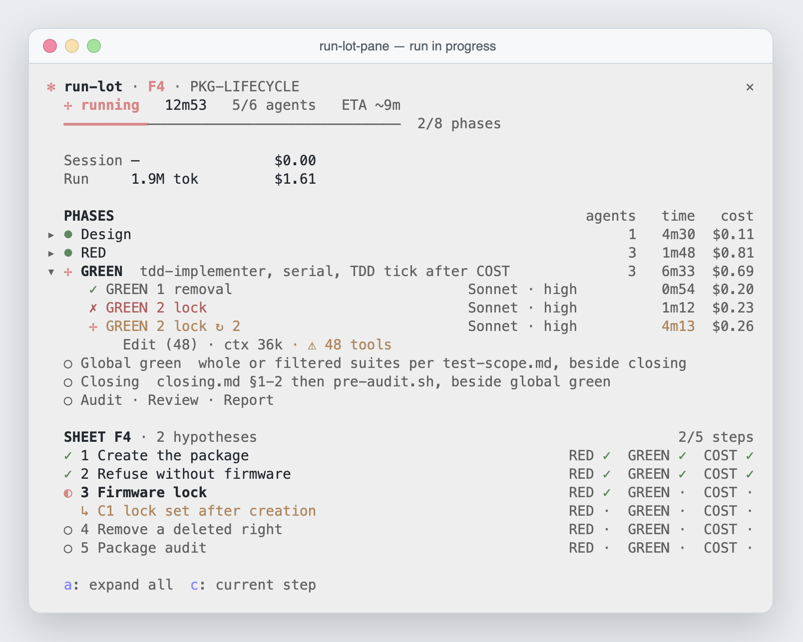
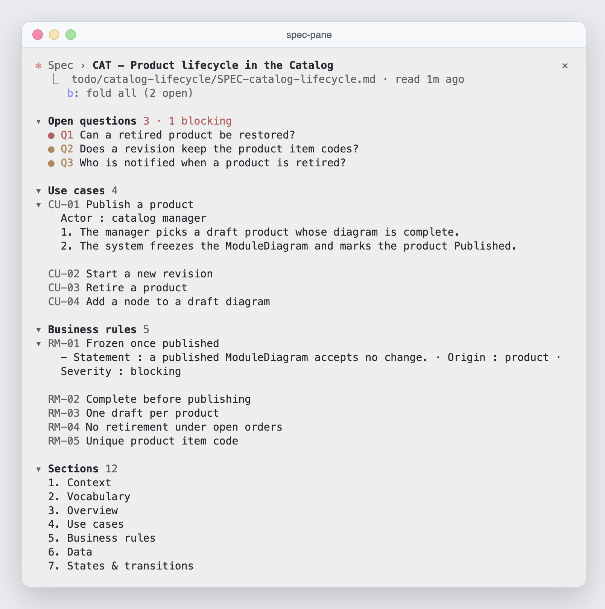
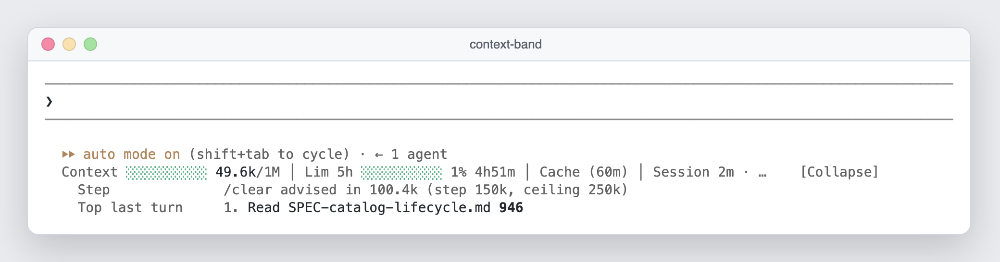

# Mods

Three optional panes drawn inside Claude Code (terminal or desktop Code tab), to see what the kit is doing without asking: where the batch stands, what the spec already holds, how full the context is. Each one is a small plugin served by the `cctoolkit` marketplace, installed on its own — the kit works without them.

## `run-lot-pane` — follow an autonomous batch

A `/cctoolkit:run-lot` batch runs for tens of minutes across a dozen agents. The pane shows it live: phases with their agents, time and cost, each agent's model and current tool, retries and stalls flagged as they happen, the batch sheet ticking RED → GREEN → COST, an estimated end, then the outcome and the audit verdict. Opens by itself when a Workflow starts; `/run-lot-pane demo` shows an example.



End of the same run: [`demo-end.png`](run-lot-pane/screenshots/demo-end.png).

## `spec-pane` — see the spec take shape

During a `/cctoolkit:business-spec`, the pane keeps the decisions you answered, the open questions by severity, the use cases, business rules and sections in view, refreshed on every write. A click unfolds a row in place. Opens by itself when the skill starts; `/spec-pane <path>` follows an existing spec.



## `context-band` — know when to `/clear`

A line under the prompt: context meter, 5h limit, prompt-cache expiry, session time and cost. `[Show all]` adds the `/clear` step (150k, ceiling 250k) and what filled the context over the last turns. Always on.



## Install

From the repo root, type it yourself — the auto-mode classifier refuses an agent enabling plugins. The marketplace is the kit's own: skip the first line if `cctoolkit` is already installed (`INSTALL.md`).

```bash
claude plugin marketplace add pierrebelin/claude-code-toolkit --scope project
claude plugin install context-band@cctoolkit --scope project
claude plugin install run-lot-pane@cctoolkit --scope project
claude plugin install spec-pane@cctoolkit --scope project
```

Take only the ones you want, then restart Claude Code in the repo. Inside a session, `/plugin install <mod>@cctoolkit` does the same.

A repo that installed them from `.claude/mods/` (the former `pierrebelinmods` marketplace): `/cctoolkit:kit-init` removes that marketplace and tells which mods to reinstall.

Check it loaded:
```bash
claude -p "ok" --max-turns 1 --debug --debug-file /tmp/mods.log >/dev/null
grep 'hooks module' /tmp/mods.log   # one "loaded" line per mod
```

## Reference

Each folder is one plugin, listed beside `cctoolkit` by the kit's marketplace (`.claude-plugin/marketplace.json` at the toolkit root). Mods live here and nowhere else — never under `skills/`, even though the engine would adopt a plugin folder there.

| Mod | What it shows | Opens |
|-----|---------------|-------|
| `context-band` | line under the prompt input, below Claude Code's hint line (replaces the statusline's second line): context meter and tokens, prompt-cache expiry, single-call streak, graphify rebuild, 5h limit, session time, turns since `/clear` and session cost, top 2 context contributors over 5 turns; `[Show all]` unfolds the `/clear` step (150k, ceiling 250k), the batching advice and the full contributor list (estimates calibrated on the turn's real growth); after a restart, turns and contributors are replayed from the transcript | by itself, every turn |
| `run-lot-pane` | side pane following a `run-lot` Workflow run (English display, demo included; English statuses `DONE` / `BLOCKED` / `GAPS` / `REVIEW-BLOCKING` and their French counterparts recognised): batch named from the sheet (F4 · PKG-LIFECYCLE), phases as columns (agents, duration, cost) with their detail, estimated end `ETA ~14m` in the header (mean durations of earlier runs, a parallel pair counted at its maximum), agents (model · effort, current tool and context, retries `↻ 2`, slowness in yellow past 2× the phase's usual time, stalls `⚠ 48 tools` / `⚠ ctx 160k` / `⚠ idle 3m`, interruption `⊘` of an agent still running when the run stops), each agent's cost split pro rata of weighted tokens when agents run in parallel, batch sheet (steps, RED/GREEN/COST, corrections, assumptions) re-read when its file changes, audit verdict by severity, run outcome as a coloured block with reason and report path, toast at the end of the run; `resumeFromRunId` resume followed without freezing the display (a stopped journal older than the relaunch is ignored); phase card and agent card; `/run-lot-pane demo` or `demo end` for an example | by itself, when a Workflow starts |
| `spec-pane` | side pane following a `/business-spec` of the current session (read-only): decisions asked through `AskUserQuestion` with their answer (`?` pending, `✓` recommended option kept, `≠` another choice), then, once `todo/<code>/SPEC-<code>.md` is written and on every change (mtime every 3 s), title, summary, §12 open questions in full, by severity, names of use cases, business rules and sections; a click unfolds the full content inline under its row (several at once, a second click folds it), `fold all` (`b`) folds them all back; collapsible groups; `/spec-pane todo/<code>/SPEC-<code>.md` follows an existing spec, `/spec-pane clear` forgets it; French and English specs both parsed | on its own, when `/business-spec` starts or a spec is written |

Screenshots taken from the real panes: `/run-lot-pane demo` and `demo end`, `/spec-pane` on a fictional spec, `context-band` after one turn.

A `tool.call` hook reads the tool's arguments flat on `e` (`e.skill`, `e.file_path`): there is no `e.input`.

## Layout of a mod

```
<mod>/
  .claude-plugin/plugin.json   name, version, description, "types": "./types/index.d.ts"
  hooks/hooks.json             { "modules": ["./register.tsx"] }
  hooks/register.tsx           export const register: Register = on => { ... }
  types/index.d.ts             the $.state contract (interface PluginState)
  tests/*.test.tsx             claude plugin test
  tsconfig.json                extends the engine-laid types
  .gitignore                   .claude-plugin/types/ (laid by the engine)
```

## Writing a new mod

1. Load the `plugin-authoring` skill: it names the session's dev-mods folder and turns hot reload on. Write and iterate there.
2. `claude plugin validate <mod>` and `claude plugin test <mod>` green.
3. Copy it here without the engine-laid types: `rsync -a --exclude .claude-plugin/types/ <dev-mods>/<mod>/ mods/<mod>/`, delete the dev-mods copy (two loaded copies of one name collide), add its row to the toolkit root's `.claude-plugin/marketplace.json` and to `enabledPlugins`.
4. `claude plugin validate .` from the toolkit root to check the marketplace.

Traps met with the API: in tests, call hooks (`fs.read`, `store.get`, `ui.open`…) answer `{ value: … }`; the fallback `ui.render` returns a tree (`<Box key="engine" />`), never `null`; `$` is only passed to functions declared at module level; when the state shape changes, merge with the empty value (`{ ...EMPTY, ...stored }`), since `$.state` survives reloads; no toast, no sound.
